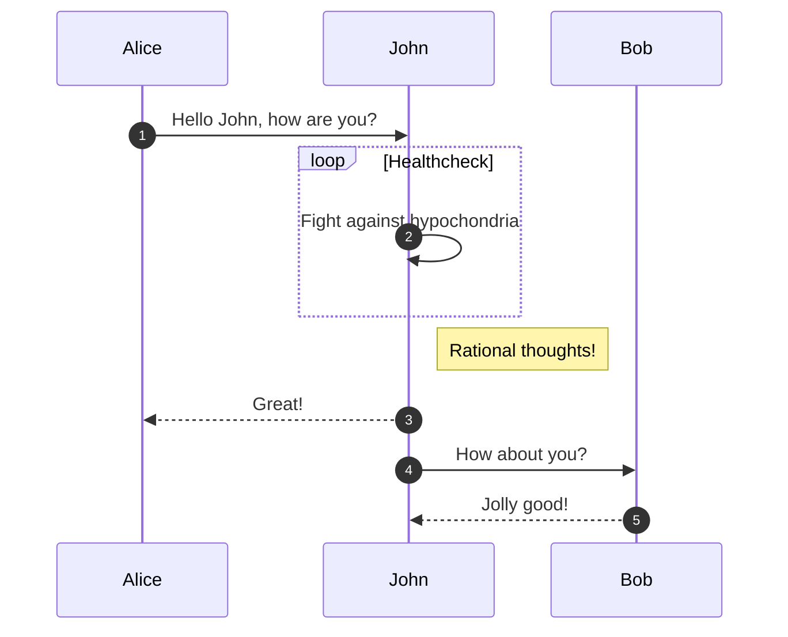
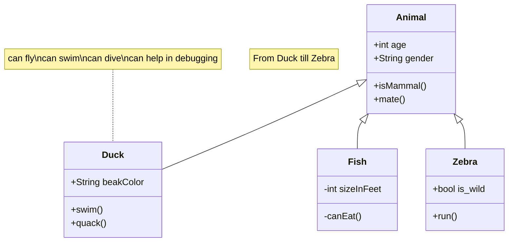
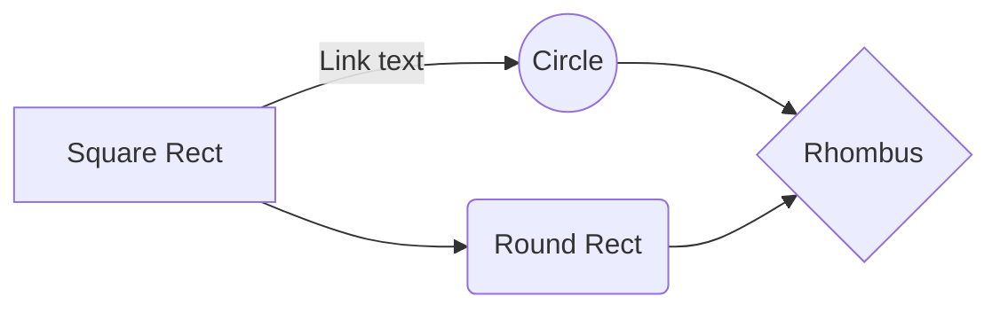
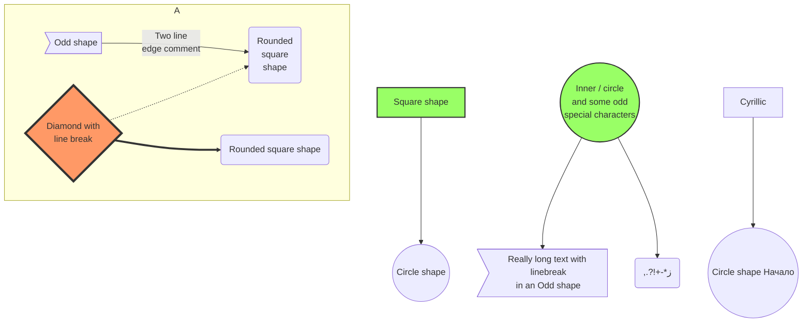
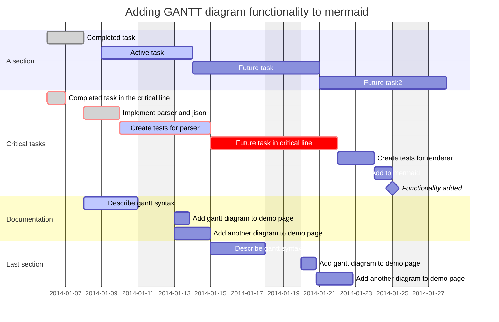
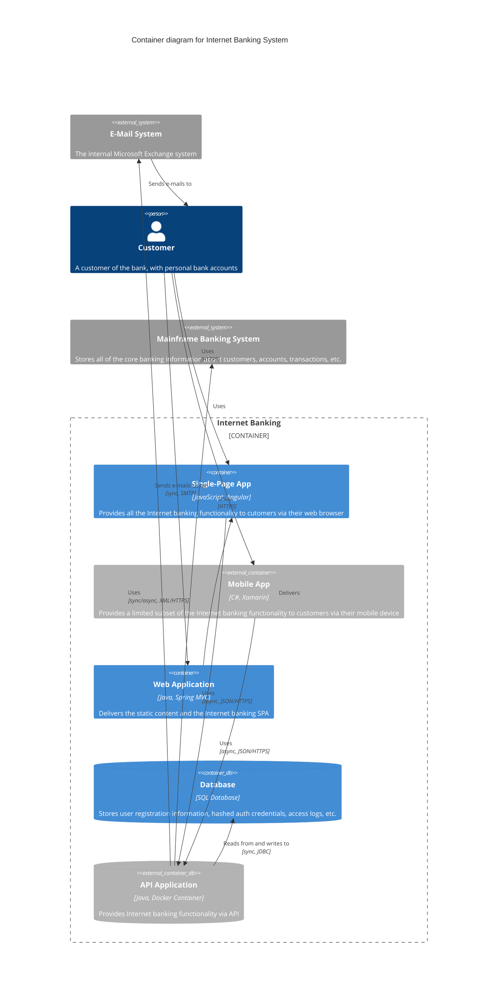

---
created: 2023-03-22T13:52:20 (UTC +01:00)
tags: []
source: https://mermaid.js.org/syntax/classDiagram.html
author: 
---

# Class diagrams | Mermaid

> ## Excerpt
> Create diagrams and visualizations using text and code.

---
# Class diagrams [#](https://mermaid.js.org/syntax/classDiagram.html#class-diagrams)

> "In software engineering, a class diagram in the Unified Modeling Language (UML) is a type of static structure diagram that describes the structure of a system by showing the system's classes, their attributes, operations (or methods), and the relationships among objects."
> 
> \-Wikipedia

The class diagram is the main building block of object-oriented modeling. It is used for general conceptual modeling of the structure of the application, and for detailed modeling to translate the models into programming code. Class diagrams can also be used for data modeling. The classes in a class diagram represent both the main elements, interactions in the application, and the classes to be programmed.

Mermaid can render class diagrams.

##### Code:

mermaid

```
---
title: Animal example
---
classDiagram
    note "From Duck till Zebra"
    Animal <|-- Duck
    note for Duck "can fly\ncan swim\ncan dive\ncan help in debugging"
    Animal <|-- Fish
    Animal <|-- Zebra
    Animal : +int age
    Animal : +String gender
    Animal: +isMammal()
    Animal: +mate()
    class Duck{
        +String beakColor
        +swim()
        +quack()
    }
    class Fish{
        -int sizeInFeet
        -canEat()
    }
    class Zebra{
        +bool is_wild
        +run()
    }
```

Animal example#mermaid-18{font-family:"trebuchet ms",verdana,arial,sans-serif;font-size:16px;fill:#ccc;}#mermaid-18 .error-icon{fill:#a44141;}#mermaid-18 .error-text{fill:#ddd;stroke:#ddd;}#mermaid-18 .edge-thickness-normal{stroke-width:2px;}#mermaid-18 .edge-thickness-thick{stroke-width:3.5px;}#mermaid-18 .edge-pattern-solid{stroke-dasharray:0;}#mermaid-18 .edge-pattern-dashed{stroke-dasharray:3;}#mermaid-18 .edge-pattern-dotted{stroke-dasharray:2;}#mermaid-18 .marker{fill:lightgrey;stroke:lightgrey;}#mermaid-18 .marker.cross{stroke:lightgrey;}#mermaid-18 svg{font-family:"trebuchet ms",verdana,arial,sans-serif;font-size:16px;}#mermaid-18 g.classGroup text{fill:#81B1DB;fill:#e0dfdf;stroke:none;font-family:"trebuchet ms",verdana,arial,sans-serif;font-size:10px;}#mermaid-18 g.classGroup text .title{font-weight:bolder;}#mermaid-18 .nodeLabel,#mermaid-18 .edgeLabel{color:#e0dfdf;}#mermaid-18 .edgeLabel .label rect{fill:#1f2020;}#mermaid-18 .label text{fill:#e0dfdf;}#mermaid-18 .edgeLabel .label span{background:#1f2020;}#mermaid-18 .classTitle{font-weight:bolder;}#mermaid-18 .node rect,#mermaid-18 .node circle,#mermaid-18 .node ellipse,#mermaid-18 .node polygon,#mermaid-18 .node path{fill:#1f2020;stroke:#81B1DB;stroke-width:1px;}#mermaid-18 .divider{stroke:#81B1DB;stroke:1;}#mermaid-18 g.clickable{cursor:pointer;}#mermaid-18 g.classGroup rect{fill:#1f2020;stroke:#81B1DB;}#mermaid-18 g.classGroup line{stroke:#81B1DB;stroke-width:1;}#mermaid-18 .classLabel .box{stroke:none;stroke-width:0;fill:#1f2020;opacity:0.5;}#mermaid-18 .classLabel .label{fill:#81B1DB;font-size:10px;}#mermaid-18 .relation{stroke:lightgrey;stroke-width:1;fill:none;}#mermaid-18 .dashed-line{stroke-dasharray:3;}#mermaid-18 .dotted-line{stroke-dasharray:1 2;}#mermaid-18 #compositionStart,#mermaid-18 .composition{fill:lightgrey!important;stroke:lightgrey!important;stroke-width:1;}#mermaid-18 #compositionEnd,#mermaid-18 .composition{fill:lightgrey!important;stroke:lightgrey!important;stroke-width:1;}#mermaid-18 #dependencyStart,#mermaid-18 .dependency{fill:lightgrey!important;stroke:lightgrey!important;stroke-width:1;}#mermaid-18 #dependencyStart,#mermaid-18 .dependency{fill:lightgrey!important;stroke:lightgrey!important;stroke-width:1;}#mermaid-18 #extensionStart,#mermaid-18 .extension{fill:#1f2020!important;stroke:lightgrey!important;stroke-width:1;}#mermaid-18 #extensionEnd,#mermaid-18 .extension{fill:#1f2020!important;stroke:lightgrey!important;stroke-width:1;}#mermaid-18 #aggregationStart,#mermaid-18 .aggregation{fill:#1f2020!important;stroke:lightgrey!important;stroke-width:1;}#mermaid-18 #aggregationEnd,#mermaid-18 .aggregation{fill:#1f2020!important;stroke:lightgrey!important;stroke-width:1;}#mermaid-18 #lollipopStart,#mermaid-18 .lollipop{fill:#1f2020!important;stroke:lightgrey!important;stroke-width:1;}#mermaid-18 #lollipopEnd,#mermaid-18 .lollipop{fill:#1f2020!important;stroke:lightgrey!important;stroke-width:1;}#mermaid-18 .edgeTerminals{font-size:11px;}#mermaid-18 .classTitleText{text-anchor:middle;font-size:18px;fill:#ccc;}#mermaid-18 :root{--mermaid-font-family:"trebuchet ms",verdana,arial,sans-serif;}

Animal

+int age

+String gender

+isMammal()

+mate()

Duck

+String beakColor

+swim()

+quack()

Fish

\-int sizeInFeet

\-canEat()

Zebra

+bool is\_wild

+run()

From Duck till Zebra

can fly  
can swim  
can dive  
can help in debugging

Animal example g3awu

## Syntax [#](https://mermaid.js.org/syntax/classDiagram.html#syntax)

### Class [#](https://mermaid.js.org/syntax/classDiagram.html#class)

UML provides mechanisms to represent class members, such as attributes and methods, and additional information about them. A single instance of a class in the diagram contains three compartments:

-   The top compartment contains the name of the class. It is printed in bold and centered, and the first letter is capitalized. It may also contain optional annotation text describing the nature of the class.
-   The middle compartment contains the attributes of the class. They are left-aligned and the first letter is lowercase.
-   The bottom compartment contains the operations the class can execute. They are also left-aligned and the first letter is lowercase.

##### Code:

mermaid

```
---
title: Bank example
---
classDiagram
    class BankAccount
    BankAccount : +String owner
    BankAccount : +Bigdecimal balance
    BankAccount : +deposit(amount)
    BankAccount : +withdrawal(amount)

```

Bank example#mermaid-46{font-family:"trebuchet ms",verdana,arial,sans-serif;font-size:16px;fill:#ccc;}#mermaid-46 .error-icon{fill:#a44141;}#mermaid-46 .error-text{fill:#ddd;stroke:#ddd;}#mermaid-46 .edge-thickness-normal{stroke-width:2px;}#mermaid-46 .edge-thickness-thick{stroke-width:3.5px;}#mermaid-46 .edge-pattern-solid{stroke-dasharray:0;}#mermaid-46 .edge-pattern-dashed{stroke-dasharray:3;}#mermaid-46 .edge-pattern-dotted{stroke-dasharray:2;}#mermaid-46 .marker{fill:lightgrey;stroke:lightgrey;}#mermaid-46 .marker.cross{stroke:lightgrey;}#mermaid-46 svg{font-family:"trebuchet ms",verdana,arial,sans-serif;font-size:16px;}#mermaid-46 g.classGroup text{fill:#81B1DB;fill:#e0dfdf;stroke:none;font-family:"trebuchet ms",verdana,arial,sans-serif;font-size:10px;}#mermaid-46 g.classGroup text .title{font-weight:bolder;}#mermaid-46 .nodeLabel,#mermaid-46 .edgeLabel{color:#e0dfdf;}#mermaid-46 .edgeLabel .label rect{fill:#1f2020;}#mermaid-46 .label text{fill:#e0dfdf;}#mermaid-46 .edgeLabel .label span{background:#1f2020;}#mermaid-46 .classTitle{font-weight:bolder;}#mermaid-46 .node rect,#mermaid-46 .node circle,#mermaid-46 .node ellipse,#mermaid-46 .node polygon,#mermaid-46 .node path{fill:#1f2020;stroke:#81B1DB;stroke-width:1px;}#mermaid-46 .divider{stroke:#81B1DB;stroke:1;}#mermaid-46 g.clickable{cursor:pointer;}#mermaid-46 g.classGroup rect{fill:#1f2020;stroke:#81B1DB;}#mermaid-46 g.classGroup line{stroke:#81B1DB;stroke-width:1;}#mermaid-46 .classLabel .box{stroke:none;stroke-width:0;fill:#1f2020;opacity:0.5;}#mermaid-46 .classLabel .label{fill:#81B1DB;font-size:10px;}#mermaid-46 .relation{stroke:lightgrey;stroke-width:1;fill:none;}#mermaid-46 .dashed-line{stroke-dasharray:3;}#mermaid-46 .dotted-line{stroke-dasharray:1 2;}#mermaid-46 #compositionStart,#mermaid-46 .composition{fill:lightgrey!important;stroke:lightgrey!important;stroke-width:1;}#mermaid-46 #compositionEnd,#mermaid-46 .composition{fill:lightgrey!important;stroke:lightgrey!important;stroke-width:1;}#mermaid-46 #dependencyStart,#mermaid-46 .dependency{fill:lightgrey!important;stroke:lightgrey!important;stroke-width:1;}#mermaid-46 #dependencyStart,#mermaid-46 .dependency{fill:lightgrey!important;stroke:lightgrey!important;stroke-width:1;}#mermaid-46 #extensionStart,#mermaid-46 .extension{fill:#1f2020!important;stroke:lightgrey!important;stroke-width:1;}#mermaid-46 #extensionEnd,#mermaid-46 .extension{fill:#1f2020!important;stroke:lightgrey!important;stroke-width:1;}#mermaid-46 #aggregationStart,#mermaid-46 .aggregation{fill:#1f2020!important;stroke:lightgrey!important;stroke-width:1;}#mermaid-46 #aggregationEnd,#mermaid-46 .aggregation{fill:#1f2020!important;stroke:lightgrey!important;stroke-width:1;}#mermaid-46 #lollipopStart,#mermaid-46 .lollipop{fill:#1f2020!important;stroke:lightgrey!important;stroke-width:1;}#mermaid-46 #lollipopEnd,#mermaid-46 .lollipop{fill:#1f2020!important;stroke:lightgrey!important;stroke-width:1;}#mermaid-46 .edgeTerminals{font-size:11px;}#mermaid-46 .classTitleText{text-anchor:middle;font-size:18px;fill:#ccc;}#mermaid-46 :root{--mermaid-font-family:"trebuchet ms",verdana,arial,sans-serif;}

BankAccount

+String owner

+Bigdecimal balance

+deposit(amount)

+withdrawal(amount)

Bank example 5o0x4c

## Define a class [#](https://mermaid.js.org/syntax/classDiagram.html#define-a-class)

There are two ways to define a class:

-   Explicitly using keyword **class** like `class Animal` which would define the Animal class.
-   Via a **relationship** which defines two classes at a time along with their relationship. For instance, `Vehicle <|-- Car`.

##### Code:

mermaid

```
classDiagram
    class Animal
    Vehicle <|-- Car
```

#mermaid-66{font-family:"trebuchet ms",verdana,arial,sans-serif;font-size:16px;fill:#ccc;}#mermaid-66 .error-icon{fill:#a44141;}#mermaid-66 .error-text{fill:#ddd;stroke:#ddd;}#mermaid-66 .edge-thickness-normal{stroke-width:2px;}#mermaid-66 .edge-thickness-thick{stroke-width:3.5px;}#mermaid-66 .edge-pattern-solid{stroke-dasharray:0;}#mermaid-66 .edge-pattern-dashed{stroke-dasharray:3;}#mermaid-66 .edge-pattern-dotted{stroke-dasharray:2;}#mermaid-66 .marker{fill:lightgrey;stroke:lightgrey;}#mermaid-66 .marker.cross{stroke:lightgrey;}#mermaid-66 svg{font-family:"trebuchet ms",verdana,arial,sans-serif;font-size:16px;}#mermaid-66 g.classGroup text{fill:#81B1DB;fill:#e0dfdf;stroke:none;font-family:"trebuchet ms",verdana,arial,sans-serif;font-size:10px;}#mermaid-66 g.classGroup text .title{font-weight:bolder;}#mermaid-66 .nodeLabel,#mermaid-66 .edgeLabel{color:#e0dfdf;}#mermaid-66 .edgeLabel .label rect{fill:#1f2020;}#mermaid-66 .label text{fill:#e0dfdf;}#mermaid-66 .edgeLabel .label span{background:#1f2020;}#mermaid-66 .classTitle{font-weight:bolder;}#mermaid-66 .node rect,#mermaid-66 .node circle,#mermaid-66 .node ellipse,#mermaid-66 .node polygon,#mermaid-66 .node path{fill:#1f2020;stroke:#81B1DB;stroke-width:1px;}#mermaid-66 .divider{stroke:#81B1DB;stroke:1;}#mermaid-66 g.clickable{cursor:pointer;}#mermaid-66 g.classGroup rect{fill:#1f2020;stroke:#81B1DB;}#mermaid-66 g.classGroup line{stroke:#81B1DB;stroke-width:1;}#mermaid-66 .classLabel .box{stroke:none;stroke-width:0;fill:#1f2020;opacity:0.5;}#mermaid-66 .classLabel .label{fill:#81B1DB;font-size:10px;}#mermaid-66 .relation{stroke:lightgrey;stroke-width:1;fill:none;}#mermaid-66 .dashed-line{stroke-dasharray:3;}#mermaid-66 .dotted-line{stroke-dasharray:1 2;}#mermaid-66 #compositionStart,#mermaid-66 .composition{fill:lightgrey!important;stroke:lightgrey!important;stroke-width:1;}#mermaid-66 #compositionEnd,#mermaid-66 .composition{fill:lightgrey!important;stroke:lightgrey!important;stroke-width:1;}#mermaid-66 #dependencyStart,#mermaid-66 .dependency{fill:lightgrey!important;stroke:lightgrey!important;stroke-width:1;}#mermaid-66 #dependencyStart,#mermaid-66 .dependency{fill:lightgrey!important;stroke:lightgrey!important;stroke-width:1;}#mermaid-66 #extensionStart,#mermaid-66 .extension{fill:#1f2020!important;stroke:lightgrey!important;stroke-width:1;}#mermaid-66 #extensionEnd,#mermaid-66 .extension{fill:#1f2020!important;stroke:lightgrey!important;stroke-width:1;}#mermaid-66 #aggregationStart,#mermaid-66 .aggregation{fill:#1f2020!important;stroke:lightgrey!important;stroke-width:1;}#mermaid-66 #aggregationEnd,#mermaid-66 .aggregation{fill:#1f2020!important;stroke:lightgrey!important;stroke-width:1;}#mermaid-66 #lollipopStart,#mermaid-66 .lollipop{fill:#1f2020!important;stroke:lightgrey!important;stroke-width:1;}#mermaid-66 #lollipopEnd,#mermaid-66 .lollipop{fill:#1f2020!important;stroke:lightgrey!important;stroke-width:1;}#mermaid-66 .edgeTerminals{font-size:11px;}#mermaid-66 .classTitleText{text-anchor:middle;font-size:18px;fill:#ccc;}#mermaid-66 :root{--mermaid-font-family:"trebuchet ms",verdana,arial,sans-serif;}

Animal

Vehicle

Car

jsm9oo

Naming convention: a class name should be composed only of alphanumeric characters (including unicode), and underscores.

### Class labels [#](https://mermaid.js.org/syntax/classDiagram.html#class-labels)

In case you need to provide a label for a class, you can use the following syntax:

##### Code:

mermaid

```
classDiagram
    class Animal["Animal with a label"]
    class Car["Car with *! symbols"]
    Animal --> Car
```

#mermaid-77{font-family:"trebuchet ms",verdana,arial,sans-serif;font-size:16px;fill:#ccc;}#mermaid-77 .error-icon{fill:#a44141;}#mermaid-77 .error-text{fill:#ddd;stroke:#ddd;}#mermaid-77 .edge-thickness-normal{stroke-width:2px;}#mermaid-77 .edge-thickness-thick{stroke-width:3.5px;}#mermaid-77 .edge-pattern-solid{stroke-dasharray:0;}#mermaid-77 .edge-pattern-dashed{stroke-dasharray:3;}#mermaid-77 .edge-pattern-dotted{stroke-dasharray:2;}#mermaid-77 .marker{fill:lightgrey;stroke:lightgrey;}#mermaid-77 .marker.cross{stroke:lightgrey;}#mermaid-77 svg{font-family:"trebuchet ms",verdana,arial,sans-serif;font-size:16px;}#mermaid-77 g.classGroup text{fill:#81B1DB;fill:#e0dfdf;stroke:none;font-family:"trebuchet ms",verdana,arial,sans-serif;font-size:10px;}#mermaid-77 g.classGroup text .title{font-weight:bolder;}#mermaid-77 .nodeLabel,#mermaid-77 .edgeLabel{color:#e0dfdf;}#mermaid-77 .edgeLabel .label rect{fill:#1f2020;}#mermaid-77 .label text{fill:#e0dfdf;}#mermaid-77 .edgeLabel .label span{background:#1f2020;}#mermaid-77 .classTitle{font-weight:bolder;}#mermaid-77 .node rect,#mermaid-77 .node circle,#mermaid-77 .node ellipse,#mermaid-77 .node polygon,#mermaid-77 .node path{fill:#1f2020;stroke:#81B1DB;stroke-width:1px;}#mermaid-77 .divider{stroke:#81B1DB;stroke:1;}#mermaid-77 g.clickable{cursor:pointer;}#mermaid-77 g.classGroup rect{fill:#1f2020;stroke:#81B1DB;}#mermaid-77 g.classGroup line{stroke:#81B1DB;stroke-width:1;}#mermaid-77 .classLabel .box{stroke:none;stroke-width:0;fill:#1f2020;opacity:0.5;}#mermaid-77 .classLabel .label{fill:#81B1DB;font-size:10px;}#mermaid-77 .relation{stroke:lightgrey;stroke-width:1;fill:none;}#mermaid-77 .dashed-line{stroke-dasharray:3;}#mermaid-77 .dotted-line{stroke-dasharray:1 2;}#mermaid-77 #compositionStart,#mermaid-77 .composition{fill:lightgrey!important;stroke:lightgrey!important;stroke-width:1;}#mermaid-77 #compositionEnd,#mermaid-77 .composition{fill:lightgrey!important;stroke:lightgrey!important;stroke-width:1;}#mermaid-77 #dependencyStart,#mermaid-77 .dependency{fill:lightgrey!important;stroke:lightgrey!important;stroke-width:1;}#mermaid-77 #dependencyStart,#mermaid-77 .dependency{fill:lightgrey!important;stroke:lightgrey!important;stroke-width:1;}#mermaid-77 #extensionStart,#mermaid-77 .extension{fill:#1f2020!important;stroke:lightgrey!important;stroke-width:1;}#mermaid-77 #extensionEnd,#mermaid-77 .extension{fill:#1f2020!important;stroke:lightgrey!important;stroke-width:1;}#mermaid-77 #aggregationStart,#mermaid-77 .aggregation{fill:#1f2020!important;stroke:lightgrey!important;stroke-width:1;}#mermaid-77 #aggregationEnd,#mermaid-77 .aggregation{fill:#1f2020!important;stroke:lightgrey!important;stroke-width:1;}#mermaid-77 #lollipopStart,#mermaid-77 .lollipop{fill:#1f2020!important;stroke:lightgrey!important;stroke-width:1;}#mermaid-77 #lollipopEnd,#mermaid-77 .lollipop{fill:#1f2020!important;stroke:lightgrey!important;stroke-width:1;}#mermaid-77 .edgeTerminals{font-size:11px;}#mermaid-77 .classTitleText{text-anchor:middle;font-size:18px;fill:#ccc;}#mermaid-77 :root{--mermaid-font-family:"trebuchet ms",verdana,arial,sans-serif;}

Animal with a label

Car with \*! symbols

93on6c

You can also use backticks to escape special characters in the label:

##### Code:

mermaid

```
classDiagram
    class `Animal Class!`
    class `Car Class`
    `Animal Class!` --> `Car Class`
```

#mermaid-82{font-family:"trebuchet ms",verdana,arial,sans-serif;font-size:16px;fill:#ccc;}#mermaid-82 .error-icon{fill:#a44141;}#mermaid-82 .error-text{fill:#ddd;stroke:#ddd;}#mermaid-82 .edge-thickness-normal{stroke-width:2px;}#mermaid-82 .edge-thickness-thick{stroke-width:3.5px;}#mermaid-82 .edge-pattern-solid{stroke-dasharray:0;}#mermaid-82 .edge-pattern-dashed{stroke-dasharray:3;}#mermaid-82 .edge-pattern-dotted{stroke-dasharray:2;}#mermaid-82 .marker{fill:lightgrey;stroke:lightgrey;}#mermaid-82 .marker.cross{stroke:lightgrey;}#mermaid-82 svg{font-family:"trebuchet ms",verdana,arial,sans-serif;font-size:16px;}#mermaid-82 g.classGroup text{fill:#81B1DB;fill:#e0dfdf;stroke:none;font-family:"trebuchet ms",verdana,arial,sans-serif;font-size:10px;}#mermaid-82 g.classGroup text .title{font-weight:bolder;}#mermaid-82 .nodeLabel,#mermaid-82 .edgeLabel{color:#e0dfdf;}#mermaid-82 .edgeLabel .label rect{fill:#1f2020;}#mermaid-82 .label text{fill:#e0dfdf;}#mermaid-82 .edgeLabel .label span{background:#1f2020;}#mermaid-82 .classTitle{font-weight:bolder;}#mermaid-82 .node rect,#mermaid-82 .node circle,#mermaid-82 .node ellipse,#mermaid-82 .node polygon,#mermaid-82 .node path{fill:#1f2020;stroke:#81B1DB;stroke-width:1px;}#mermaid-82 .divider{stroke:#81B1DB;stroke:1;}#mermaid-82 g.clickable{cursor:pointer;}#mermaid-82 g.classGroup rect{fill:#1f2020;stroke:#81B1DB;}#mermaid-82 g.classGroup line{stroke:#81B1DB;stroke-width:1;}#mermaid-82 .classLabel .box{stroke:none;stroke-width:0;fill:#1f2020;opacity:0.5;}#mermaid-82 .classLabel .label{fill:#81B1DB;font-size:10px;}#mermaid-82 .relation{stroke:lightgrey;stroke-width:1;fill:none;}#mermaid-82 .dashed-line{stroke-dasharray:3;}#mermaid-82 .dotted-line{stroke-dasharray:1 2;}#mermaid-82 #compositionStart,#mermaid-82 .composition{fill:lightgrey!important;stroke:lightgrey!important;stroke-width:1;}#mermaid-82 #compositionEnd,#mermaid-82 .composition{fill:lightgrey!important;stroke:lightgrey!important;stroke-width:1;}#mermaid-82 #dependencyStart,#mermaid-82 .dependency{fill:lightgrey!important;stroke:lightgrey!important;stroke-width:1;}#mermaid-82 #dependencyStart,#mermaid-82 .dependency{fill:lightgrey!important;stroke:lightgrey!important;stroke-width:1;}#mermaid-82 #extensionStart,#mermaid-82 .extension{fill:#1f2020!important;stroke:lightgrey!important;stroke-width:1;}#mermaid-82 #extensionEnd,#mermaid-82 .extension{fill:#1f2020!important;stroke:lightgrey!important;stroke-width:1;}#mermaid-82 #aggregationStart,#mermaid-82 .aggregation{fill:#1f2020!important;stroke:lightgrey!important;stroke-width:1;}#mermaid-82 #aggregationEnd,#mermaid-82 .aggregation{fill:#1f2020!important;stroke:lightgrey!important;stroke-width:1;}#mermaid-82 #lollipopStart,#mermaid-82 .lollipop{fill:#1f2020!important;stroke:lightgrey!important;stroke-width:1;}#mermaid-82 #lollipopEnd,#mermaid-82 .lollipop{fill:#1f2020!important;stroke:lightgrey!important;stroke-width:1;}#mermaid-82 .edgeTerminals{font-size:11px;}#mermaid-82 .classTitleText{text-anchor:middle;font-size:18px;fill:#ccc;}#mermaid-82 :root{--mermaid-font-family:"trebuchet ms",verdana,arial,sans-serif;}

Animal Class!

Car Class

u73fkp

## Defining Members of a class [#](https://mermaid.js.org/syntax/classDiagram.html#defining-members-of-a-class)

UML provides mechanisms to represent class members such as attributes and methods, as well as additional information about them.

Mermaid distinguishes between attributes and functions/methods based on if the **parenthesis** `()` are present or not. The ones with `()` are treated as functions/methods, and all others as attributes.

There are two ways to define the members of a class, and regardless of whichever syntax is used to define the members, the output will still be same. The two different ways are :

-   Associate a member of a class using **:** (colon) followed by member name, useful to define one member at a time. For example:

##### Code:

mermaid

```
classDiagram
class BankAccount
BankAccount : +String owner
BankAccount : +BigDecimal balance
BankAccount : +deposit(amount)
BankAccount : +withdrawal(amount)
```

#mermaid-103{font-family:"trebuchet ms",verdana,arial,sans-serif;font-size:16px;fill:#ccc;}#mermaid-103 .error-icon{fill:#a44141;}#mermaid-103 .error-text{fill:#ddd;stroke:#ddd;}#mermaid-103 .edge-thickness-normal{stroke-width:2px;}#mermaid-103 .edge-thickness-thick{stroke-width:3.5px;}#mermaid-103 .edge-pattern-solid{stroke-dasharray:0;}#mermaid-103 .edge-pattern-dashed{stroke-dasharray:3;}#mermaid-103 .edge-pattern-dotted{stroke-dasharray:2;}#mermaid-103 .marker{fill:lightgrey;stroke:lightgrey;}#mermaid-103 .marker.cross{stroke:lightgrey;}#mermaid-103 svg{font-family:"trebuchet ms",verdana,arial,sans-serif;font-size:16px;}#mermaid-103 g.classGroup text{fill:#81B1DB;fill:#e0dfdf;stroke:none;font-family:"trebuchet ms",verdana,arial,sans-serif;font-size:10px;}#mermaid-103 g.classGroup text .title{font-weight:bolder;}#mermaid-103 .nodeLabel,#mermaid-103 .edgeLabel{color:#e0dfdf;}#mermaid-103 .edgeLabel .label rect{fill:#1f2020;}#mermaid-103 .label text{fill:#e0dfdf;}#mermaid-103 .edgeLabel .label span{background:#1f2020;}#mermaid-103 .classTitle{font-weight:bolder;}#mermaid-103 .node rect,#mermaid-103 .node circle,#mermaid-103 .node ellipse,#mermaid-103 .node polygon,#mermaid-103 .node path{fill:#1f2020;stroke:#81B1DB;stroke-width:1px;}#mermaid-103 .divider{stroke:#81B1DB;stroke:1;}#mermaid-103 g.clickable{cursor:pointer;}#mermaid-103 g.classGroup rect{fill:#1f2020;stroke:#81B1DB;}#mermaid-103 g.classGroup line{stroke:#81B1DB;stroke-width:1;}#mermaid-103 .classLabel .box{stroke:none;stroke-width:0;fill:#1f2020;opacity:0.5;}#mermaid-103 .classLabel .label{fill:#81B1DB;font-size:10px;}#mermaid-103 .relation{stroke:lightgrey;stroke-width:1;fill:none;}#mermaid-103 .dashed-line{stroke-dasharray:3;}#mermaid-103 .dotted-line{stroke-dasharray:1 2;}#mermaid-103 #compositionStart,#mermaid-103 .composition{fill:lightgrey!important;stroke:lightgrey!important;stroke-width:1;}#mermaid-103 #compositionEnd,#mermaid-103 .composition{fill:lightgrey!important;stroke:lightgrey!important;stroke-width:1;}#mermaid-103 #dependencyStart,#mermaid-103 .dependency{fill:lightgrey!important;stroke:lightgrey!important;stroke-width:1;}#mermaid-103 #dependencyStart,#mermaid-103 .dependency{fill:lightgrey!important;stroke:lightgrey!important;stroke-width:1;}#mermaid-103 #extensionStart,#mermaid-103 .extension{fill:#1f2020!important;stroke:lightgrey!important;stroke-width:1;}#mermaid-103 #extensionEnd,#mermaid-103 .extension{fill:#1f2020!important;stroke:lightgrey!important;stroke-width:1;}#mermaid-103 #aggregationStart,#mermaid-103 .aggregation{fill:#1f2020!important;stroke:lightgrey!important;stroke-width:1;}#mermaid-103 #aggregationEnd,#mermaid-103 .aggregation{fill:#1f2020!important;stroke:lightgrey!important;stroke-width:1;}#mermaid-103 #lollipopStart,#mermaid-103 .lollipop{fill:#1f2020!important;stroke:lightgrey!important;stroke-width:1;}#mermaid-103 #lollipopEnd,#mermaid-103 .lollipop{fill:#1f2020!important;stroke:lightgrey!important;stroke-width:1;}#mermaid-103 .edgeTerminals{font-size:11px;}#mermaid-103 .classTitleText{text-anchor:middle;font-size:18px;fill:#ccc;}#mermaid-103 :root{--mermaid-font-family:"trebuchet ms",verdana,arial,sans-serif;}

BankAccount

+String owner

+BigDecimal balance

+deposit(amount)

+withdrawal(amount)

nw6jcp

-   Associate members of a class using **{}** brackets, where members are grouped within curly brackets. Suitable for defining multiple members at once. For example:

##### Code:

mermaid

```
classDiagram
class BankAccount{
    +String owner
    +BigDecimal balance
    +deposit(amount)
    +withdrawal(amount)
}
```

#mermaid-112{font-family:"trebuchet ms",verdana,arial,sans-serif;font-size:16px;fill:#ccc;}#mermaid-112 .error-icon{fill:#a44141;}#mermaid-112 .error-text{fill:#ddd;stroke:#ddd;}#mermaid-112 .edge-thickness-normal{stroke-width:2px;}#mermaid-112 .edge-thickness-thick{stroke-width:3.5px;}#mermaid-112 .edge-pattern-solid{stroke-dasharray:0;}#mermaid-112 .edge-pattern-dashed{stroke-dasharray:3;}#mermaid-112 .edge-pattern-dotted{stroke-dasharray:2;}#mermaid-112 .marker{fill:lightgrey;stroke:lightgrey;}#mermaid-112 .marker.cross{stroke:lightgrey;}#mermaid-112 svg{font-family:"trebuchet ms",verdana,arial,sans-serif;font-size:16px;}#mermaid-112 g.classGroup text{fill:#81B1DB;fill:#e0dfdf;stroke:none;font-family:"trebuchet ms",verdana,arial,sans-serif;font-size:10px;}#mermaid-112 g.classGroup text .title{font-weight:bolder;}#mermaid-112 .nodeLabel,#mermaid-112 .edgeLabel{color:#e0dfdf;}#mermaid-112 .edgeLabel .label rect{fill:#1f2020;}#mermaid-112 .label text{fill:#e0dfdf;}#mermaid-112 .edgeLabel .label span{background:#1f2020;}#mermaid-112 .classTitle{font-weight:bolder;}#mermaid-112 .node rect,#mermaid-112 .node circle,#mermaid-112 .node ellipse,#mermaid-112 .node polygon,#mermaid-112 .node path{fill:#1f2020;stroke:#81B1DB;stroke-width:1px;}#mermaid-112 .divider{stroke:#81B1DB;stroke:1;}#mermaid-112 g.clickable{cursor:pointer;}#mermaid-112 g.classGroup rect{fill:#1f2020;stroke:#81B1DB;}#mermaid-112 g.classGroup line{stroke:#81B1DB;stroke-width:1;}#mermaid-112 .classLabel .box{stroke:none;stroke-width:0;fill:#1f2020;opacity:0.5;}#mermaid-112 .classLabel .label{fill:#81B1DB;font-size:10px;}#mermaid-112 .relation{stroke:lightgrey;stroke-width:1;fill:none;}#mermaid-112 .dashed-line{stroke-dasharray:3;}#mermaid-112 .dotted-line{stroke-dasharray:1 2;}#mermaid-112 #compositionStart,#mermaid-112 .composition{fill:lightgrey!important;stroke:lightgrey!important;stroke-width:1;}#mermaid-112 #compositionEnd,#mermaid-112 .composition{fill:lightgrey!important;stroke:lightgrey!important;stroke-width:1;}#mermaid-112 #dependencyStart,#mermaid-112 .dependency{fill:lightgrey!important;stroke:lightgrey!important;stroke-width:1;}#mermaid-112 #dependencyStart,#mermaid-112 .dependency{fill:lightgrey!important;stroke:lightgrey!important;stroke-width:1;}#mermaid-112 #extensionStart,#mermaid-112 .extension{fill:#1f2020!important;stroke:lightgrey!important;stroke-width:1;}#mermaid-112 #extensionEnd,#mermaid-112 .extension{fill:#1f2020!important;stroke:lightgrey!important;stroke-width:1;}#mermaid-112 #aggregationStart,#mermaid-112 .aggregation{fill:#1f2020!important;stroke:lightgrey!important;stroke-width:1;}#mermaid-112 #aggregationEnd,#mermaid-112 .aggregation{fill:#1f2020!important;stroke:lightgrey!important;stroke-width:1;}#mermaid-112 #lollipopStart,#mermaid-112 .lollipop{fill:#1f2020!important;stroke:lightgrey!important;stroke-width:1;}#mermaid-112 #lollipopEnd,#mermaid-112 .lollipop{fill:#1f2020!important;stroke:lightgrey!important;stroke-width:1;}#mermaid-112 .edgeTerminals{font-size:11px;}#mermaid-112 .classTitleText{text-anchor:middle;font-size:18px;fill:#ccc;}#mermaid-112 :root{--mermaid-font-family:"trebuchet ms",verdana,arial,sans-serif;}

BankAccount

+String owner

+BigDecimal balance

+deposit(amount)

+withdrawal(amount)

bme72q

#### Return Type [#](https://mermaid.js.org/syntax/classDiagram.html#return-type)

Optionally you can end a method/function definition with the data type that will be returned (note: there must be a space between the final `)` and the return type). An example:

##### Code:

mermaid

```
classDiagram
class BankAccount{
    +String owner
    +BigDecimal balance
    +deposit(amount) bool
    +withdrawal(amount) int
}
```

#mermaid-120{font-family:"trebuchet ms",verdana,arial,sans-serif;font-size:16px;fill:#ccc;}#mermaid-120 .error-icon{fill:#a44141;}#mermaid-120 .error-text{fill:#ddd;stroke:#ddd;}#mermaid-120 .edge-thickness-normal{stroke-width:2px;}#mermaid-120 .edge-thickness-thick{stroke-width:3.5px;}#mermaid-120 .edge-pattern-solid{stroke-dasharray:0;}#mermaid-120 .edge-pattern-dashed{stroke-dasharray:3;}#mermaid-120 .edge-pattern-dotted{stroke-dasharray:2;}#mermaid-120 .marker{fill:lightgrey;stroke:lightgrey;}#mermaid-120 .marker.cross{stroke:lightgrey;}#mermaid-120 svg{font-family:"trebuchet ms",verdana,arial,sans-serif;font-size:16px;}#mermaid-120 g.classGroup text{fill:#81B1DB;fill:#e0dfdf;stroke:none;font-family:"trebuchet ms",verdana,arial,sans-serif;font-size:10px;}#mermaid-120 g.classGroup text .title{font-weight:bolder;}#mermaid-120 .nodeLabel,#mermaid-120 .edgeLabel{color:#e0dfdf;}#mermaid-120 .edgeLabel .label rect{fill:#1f2020;}#mermaid-120 .label text{fill:#e0dfdf;}#mermaid-120 .edgeLabel .label span{background:#1f2020;}#mermaid-120 .classTitle{font-weight:bolder;}#mermaid-120 .node rect,#mermaid-120 .node circle,#mermaid-120 .node ellipse,#mermaid-120 .node polygon,#mermaid-120 .node path{fill:#1f2020;stroke:#81B1DB;stroke-width:1px;}#mermaid-120 .divider{stroke:#81B1DB;stroke:1;}#mermaid-120 g.clickable{cursor:pointer;}#mermaid-120 g.classGroup rect{fill:#1f2020;stroke:#81B1DB;}#mermaid-120 g.classGroup line{stroke:#81B1DB;stroke-width:1;}#mermaid-120 .classLabel .box{stroke:none;stroke-width:0;fill:#1f2020;opacity:0.5;}#mermaid-120 .classLabel .label{fill:#81B1DB;font-size:10px;}#mermaid-120 .relation{stroke:lightgrey;stroke-width:1;fill:none;}#mermaid-120 .dashed-line{stroke-dasharray:3;}#mermaid-120 .dotted-line{stroke-dasharray:1 2;}#mermaid-120 #compositionStart,#mermaid-120 .composition{fill:lightgrey!important;stroke:lightgrey!important;stroke-width:1;}#mermaid-120 #compositionEnd,#mermaid-120 .composition{fill:lightgrey!important;stroke:lightgrey!important;stroke-width:1;}#mermaid-120 #dependencyStart,#mermaid-120 .dependency{fill:lightgrey!important;stroke:lightgrey!important;stroke-width:1;}#mermaid-120 #dependencyStart,#mermaid-120 .dependency{fill:lightgrey!important;stroke:lightgrey!important;stroke-width:1;}#mermaid-120 #extensionStart,#mermaid-120 .extension{fill:#1f2020!important;stroke:lightgrey!important;stroke-width:1;}#mermaid-120 #extensionEnd,#mermaid-120 .extension{fill:#1f2020!important;stroke:lightgrey!important;stroke-width:1;}#mermaid-120 #aggregationStart,#mermaid-120 .aggregation{fill:#1f2020!important;stroke:lightgrey!important;stroke-width:1;}#mermaid-120 #aggregationEnd,#mermaid-120 .aggregation{fill:#1f2020!important;stroke:lightgrey!important;stroke-width:1;}#mermaid-120 #lollipopStart,#mermaid-120 .lollipop{fill:#1f2020!important;stroke:lightgrey!important;stroke-width:1;}#mermaid-120 #lollipopEnd,#mermaid-120 .lollipop{fill:#1f2020!important;stroke:lightgrey!important;stroke-width:1;}#mermaid-120 .edgeTerminals{font-size:11px;}#mermaid-120 .classTitleText{text-anchor:middle;font-size:18px;fill:#ccc;}#mermaid-120 :root{--mermaid-font-family:"trebuchet ms",verdana,arial,sans-serif;}

BankAccount

+String owner

+BigDecimal balance

+deposit(amount) : bool

+withdrawal(amount) : int

mpj9nu

#### Generic Types [#](https://mermaid.js.org/syntax/classDiagram.html#generic-types)

Members can be defined using generic types, such as `List<int>`, for fields, parameters, and return types by enclosing the type within `~` (**tilde**). **Nested** type declarations such as `List<List<int>>` are supported.

Generics can be represented as part of a class definition and also in the parameters or the return value of a method/function:

##### Code:

mermaid

```
classDiagram
class Square~Shape~{
    int id
    List~int~ position
    setPoints(List~int~ points)
    getPoints() List~int~
}

Square : -List~string~ messages
Square : +setMessages(List~string~ messages)
Square : +getMessages() List~string~
Square : +getDistanceMatrix() List~List~int~~
```

#mermaid-131{font-family:"trebuchet ms",verdana,arial,sans-serif;font-size:16px;fill:#ccc;}#mermaid-131 .error-icon{fill:#a44141;}#mermaid-131 .error-text{fill:#ddd;stroke:#ddd;}#mermaid-131 .edge-thickness-normal{stroke-width:2px;}#mermaid-131 .edge-thickness-thick{stroke-width:3.5px;}#mermaid-131 .edge-pattern-solid{stroke-dasharray:0;}#mermaid-131 .edge-pattern-dashed{stroke-dasharray:3;}#mermaid-131 .edge-pattern-dotted{stroke-dasharray:2;}#mermaid-131 .marker{fill:lightgrey;stroke:lightgrey;}#mermaid-131 .marker.cross{stroke:lightgrey;}#mermaid-131 svg{font-family:"trebuchet ms",verdana,arial,sans-serif;font-size:16px;}#mermaid-131 g.classGroup text{fill:#81B1DB;fill:#e0dfdf;stroke:none;font-family:"trebuchet ms",verdana,arial,sans-serif;font-size:10px;}#mermaid-131 g.classGroup text .title{font-weight:bolder;}#mermaid-131 .nodeLabel,#mermaid-131 .edgeLabel{color:#e0dfdf;}#mermaid-131 .edgeLabel .label rect{fill:#1f2020;}#mermaid-131 .label text{fill:#e0dfdf;}#mermaid-131 .edgeLabel .label span{background:#1f2020;}#mermaid-131 .classTitle{font-weight:bolder;}#mermaid-131 .node rect,#mermaid-131 .node circle,#mermaid-131 .node ellipse,#mermaid-131 .node polygon,#mermaid-131 .node path{fill:#1f2020;stroke:#81B1DB;stroke-width:1px;}#mermaid-131 .divider{stroke:#81B1DB;stroke:1;}#mermaid-131 g.clickable{cursor:pointer;}#mermaid-131 g.classGroup rect{fill:#1f2020;stroke:#81B1DB;}#mermaid-131 g.classGroup line{stroke:#81B1DB;stroke-width:1;}#mermaid-131 .classLabel .box{stroke:none;stroke-width:0;fill:#1f2020;opacity:0.5;}#mermaid-131 .classLabel .label{fill:#81B1DB;font-size:10px;}#mermaid-131 .relation{stroke:lightgrey;stroke-width:1;fill:none;}#mermaid-131 .dashed-line{stroke-dasharray:3;}#mermaid-131 .dotted-line{stroke-dasharray:1 2;}#mermaid-131 #compositionStart,#mermaid-131 .composition{fill:lightgrey!important;stroke:lightgrey!important;stroke-width:1;}#mermaid-131 #compositionEnd,#mermaid-131 .composition{fill:lightgrey!important;stroke:lightgrey!important;stroke-width:1;}#mermaid-131 #dependencyStart,#mermaid-131 .dependency{fill:lightgrey!important;stroke:lightgrey!important;stroke-width:1;}#mermaid-131 #dependencyStart,#mermaid-131 .dependency{fill:lightgrey!important;stroke:lightgrey!important;stroke-width:1;}#mermaid-131 #extensionStart,#mermaid-131 .extension{fill:#1f2020!important;stroke:lightgrey!important;stroke-width:1;}#mermaid-131 #extensionEnd,#mermaid-131 .extension{fill:#1f2020!important;stroke:lightgrey!important;stroke-width:1;}#mermaid-131 #aggregationStart,#mermaid-131 .aggregation{fill:#1f2020!important;stroke:lightgrey!important;stroke-width:1;}#mermaid-131 #aggregationEnd,#mermaid-131 .aggregation{fill:#1f2020!important;stroke:lightgrey!important;stroke-width:1;}#mermaid-131 #lollipopStart,#mermaid-131 .lollipop{fill:#1f2020!important;stroke:lightgrey!important;stroke-width:1;}#mermaid-131 #lollipopEnd,#mermaid-131 .lollipop{fill:#1f2020!important;stroke:lightgrey!important;stroke-width:1;}#mermaid-131 .edgeTerminals{font-size:11px;}#mermaid-131 .classTitleText{text-anchor:middle;font-size:18px;fill:#ccc;}#mermaid-131 :root{--mermaid-font-family:"trebuchet ms",verdana,arial,sans-serif;}

Square<Shape>

int id

List<int> position

\-List<string> messages

setPoints(List<int> points)

getPoints() : List<int>

+setMessages(List<string> messages)

+getMessages() : List<string>

+getDistanceMatrix() : List<List<int>>

ityohi

#### Visibility [#](https://mermaid.js.org/syntax/classDiagram.html#visibility)

To describe the visibility (or encapsulation) of an attribute or method/function that is a part of a class (i.e. a class member), optional notation may be placed before that members' name:

-   `+` Public
-   `-` Private
-   `#` Protected
-   `~` Package/Internal

> _note_ you can also include additional _classifiers_ to a method definition by adding the following notation to the _end_ of the method, i.e.: after the `()`:
> 
> -   `*` Abstract e.g.: `someAbstractMethod()*`
> -   `$` Static e.g.: `someStaticMethod()$`

> _note_ you can also include additional _classifiers_ to a field definition by adding the following notation to the end of its name:
> 
> -   `$` Static e.g.: `String someField$`

## Defining Relationship [#](https://mermaid.js.org/syntax/classDiagram.html#defining-relationship)

A relationship is a general term covering the specific types of logical connections found on class and object diagrams.

```
[classA][Arrow][ClassB]
```

There are eight different types of relations defined for classes under UML which are currently supported:

| Type | Description |
| --- | --- |
| `<|--` | Inheritance |
| `*--` | Composition |
| `o--` | Aggregation |
| `-->` | Association |
| `--` | Link (Solid) |
| `..>` | Dependency |
| `..|>` | Realization |
| `..` | Link (Dashed) |

##### Code:

mermaid

```
classDiagram
classA <|-- classB
classC *-- classD
classE o-- classF
classG <-- classH
classI -- classJ
classK <.. classL
classM <|.. classN
classO .. classP

```

#mermaid-278{font-family:"trebuchet ms",verdana,arial,sans-serif;font-size:16px;fill:#ccc;}#mermaid-278 .error-icon{fill:#a44141;}#mermaid-278 .error-text{fill:#ddd;stroke:#ddd;}#mermaid-278 .edge-thickness-normal{stroke-width:2px;}#mermaid-278 .edge-thickness-thick{stroke-width:3.5px;}#mermaid-278 .edge-pattern-solid{stroke-dasharray:0;}#mermaid-278 .edge-pattern-dashed{stroke-dasharray:3;}#mermaid-278 .edge-pattern-dotted{stroke-dasharray:2;}#mermaid-278 .marker{fill:lightgrey;stroke:lightgrey;}#mermaid-278 .marker.cross{stroke:lightgrey;}#mermaid-278 svg{font-family:"trebuchet ms",verdana,arial,sans-serif;font-size:16px;}#mermaid-278 g.classGroup text{fill:#81B1DB;fill:#e0dfdf;stroke:none;font-family:"trebuchet ms",verdana,arial,sans-serif;font-size:10px;}#mermaid-278 g.classGroup text .title{font-weight:bolder;}#mermaid-278 .nodeLabel,#mermaid-278 .edgeLabel{color:#e0dfdf;}#mermaid-278 .edgeLabel .label rect{fill:#1f2020;}#mermaid-278 .label text{fill:#e0dfdf;}#mermaid-278 .edgeLabel .label span{background:#1f2020;}#mermaid-278 .classTitle{font-weight:bolder;}#mermaid-278 .node rect,#mermaid-278 .node circle,#mermaid-278 .node ellipse,#mermaid-278 .node polygon,#mermaid-278 .node path{fill:#1f2020;stroke:#81B1DB;stroke-width:1px;}#mermaid-278 .divider{stroke:#81B1DB;stroke:1;}#mermaid-278 g.clickable{cursor:pointer;}#mermaid-278 g.classGroup rect{fill:#1f2020;stroke:#81B1DB;}#mermaid-278 g.classGroup line{stroke:#81B1DB;stroke-width:1;}#mermaid-278 .classLabel .box{stroke:none;stroke-width:0;fill:#1f2020;opacity:0.5;}#mermaid-278 .classLabel .label{fill:#81B1DB;font-size:10px;}#mermaid-278 .relation{stroke:lightgrey;stroke-width:1;fill:none;}#mermaid-278 .dashed-line{stroke-dasharray:3;}#mermaid-278 .dotted-line{stroke-dasharray:1 2;}#mermaid-278 #compositionStart,#mermaid-278 .composition{fill:lightgrey!important;stroke:lightgrey!important;stroke-width:1;}#mermaid-278 #compositionEnd,#mermaid-278 .composition{fill:lightgrey!important;stroke:lightgrey!important;stroke-width:1;}#mermaid-278 #dependencyStart,#mermaid-278 .dependency{fill:lightgrey!important;stroke:lightgrey!important;stroke-width:1;}#mermaid-278 #dependencyStart,#mermaid-278 .dependency{fill:lightgrey!important;stroke:lightgrey!important;stroke-width:1;}#mermaid-278 #extensionStart,#mermaid-278 .extension{fill:#1f2020!important;stroke:lightgrey!important;stroke-width:1;}#mermaid-278 #extensionEnd,#mermaid-278 .extension{fill:#1f2020!important;stroke:lightgrey!important;stroke-width:1;}#mermaid-278 #aggregationStart,#mermaid-278 .aggregation{fill:#1f2020!important;stroke:lightgrey!important;stroke-width:1;}#mermaid-278 #aggregationEnd,#mermaid-278 .aggregation{fill:#1f2020!important;stroke:lightgrey!important;stroke-width:1;}#mermaid-278 #lollipopStart,#mermaid-278 .lollipop{fill:#1f2020!important;stroke:lightgrey!important;stroke-width:1;}#mermaid-278 #lollipopEnd,#mermaid-278 .lollipop{fill:#1f2020!important;stroke:lightgrey!important;stroke-width:1;}#mermaid-278 .edgeTerminals{font-size:11px;}#mermaid-278 .classTitleText{text-anchor:middle;font-size:18px;fill:#ccc;}#mermaid-278 :root{--mermaid-font-family:"trebuchet ms",verdana,arial,sans-serif;}

classA

classB

classC

classD

classE

classF

classG

classH

classI

classJ

classK

classL

classM

classN

classO

classP

vo9fwb

We can use the labels to describe the nature of the relation between two classes. Also, arrowheads can be used in the opposite direction as well:

##### Code:

mermaid

```
classDiagram
classA --|> classB : Inheritance
classC --* classD : Composition
classE --o classF : Aggregation
classG --> classH : Association
classI -- classJ : Link(Solid)
classK ..> classL : Dependency
classM ..|> classN : Realization
classO .. classP : Link(Dashed)

```

#mermaid-283{font-family:"trebuchet ms",verdana,arial,sans-serif;font-size:16px;fill:#ccc;}#mermaid-283 .error-icon{fill:#a44141;}#mermaid-283 .error-text{fill:#ddd;stroke:#ddd;}#mermaid-283 .edge-thickness-normal{stroke-width:2px;}#mermaid-283 .edge-thickness-thick{stroke-width:3.5px;}#mermaid-283 .edge-pattern-solid{stroke-dasharray:0;}#mermaid-283 .edge-pattern-dashed{stroke-dasharray:3;}#mermaid-283 .edge-pattern-dotted{stroke-dasharray:2;}#mermaid-283 .marker{fill:lightgrey;stroke:lightgrey;}#mermaid-283 .marker.cross{stroke:lightgrey;}#mermaid-283 svg{font-family:"trebuchet ms",verdana,arial,sans-serif;font-size:16px;}#mermaid-283 g.classGroup text{fill:#81B1DB;fill:#e0dfdf;stroke:none;font-family:"trebuchet ms",verdana,arial,sans-serif;font-size:10px;}#mermaid-283 g.classGroup text .title{font-weight:bolder;}#mermaid-283 .nodeLabel,#mermaid-283 .edgeLabel{color:#e0dfdf;}#mermaid-283 .edgeLabel .label rect{fill:#1f2020;}#mermaid-283 .label text{fill:#e0dfdf;}#mermaid-283 .edgeLabel .label span{background:#1f2020;}#mermaid-283 .classTitle{font-weight:bolder;}#mermaid-283 .node rect,#mermaid-283 .node circle,#mermaid-283 .node ellipse,#mermaid-283 .node polygon,#mermaid-283 .node path{fill:#1f2020;stroke:#81B1DB;stroke-width:1px;}#mermaid-283 .divider{stroke:#81B1DB;stroke:1;}#mermaid-283 g.clickable{cursor:pointer;}#mermaid-283 g.classGroup rect{fill:#1f2020;stroke:#81B1DB;}#mermaid-283 g.classGroup line{stroke:#81B1DB;stroke-width:1;}#mermaid-283 .classLabel .box{stroke:none;stroke-width:0;fill:#1f2020;opacity:0.5;}#mermaid-283 .classLabel .label{fill:#81B1DB;font-size:10px;}#mermaid-283 .relation{stroke:lightgrey;stroke-width:1;fill:none;}#mermaid-283 .dashed-line{stroke-dasharray:3;}#mermaid-283 .dotted-line{stroke-dasharray:1 2;}#mermaid-283 #compositionStart,#mermaid-283 .composition{fill:lightgrey!important;stroke:lightgrey!important;stroke-width:1;}#mermaid-283 #compositionEnd,#mermaid-283 .composition{fill:lightgrey!important;stroke:lightgrey!important;stroke-width:1;}#mermaid-283 #dependencyStart,#mermaid-283 .dependency{fill:lightgrey!important;stroke:lightgrey!important;stroke-width:1;}#mermaid-283 #dependencyStart,#mermaid-283 .dependency{fill:lightgrey!important;stroke:lightgrey!important;stroke-width:1;}#mermaid-283 #extensionStart,#mermaid-283 .extension{fill:#1f2020!important;stroke:lightgrey!important;stroke-width:1;}#mermaid-283 #extensionEnd,#mermaid-283 .extension{fill:#1f2020!important;stroke:lightgrey!important;stroke-width:1;}#mermaid-283 #aggregationStart,#mermaid-283 .aggregation{fill:#1f2020!important;stroke:lightgrey!important;stroke-width:1;}#mermaid-283 #aggregationEnd,#mermaid-283 .aggregation{fill:#1f2020!important;stroke:lightgrey!important;stroke-width:1;}#mermaid-283 #lollipopStart,#mermaid-283 .lollipop{fill:#1f2020!important;stroke:lightgrey!important;stroke-width:1;}#mermaid-283 #lollipopEnd,#mermaid-283 .lollipop{fill:#1f2020!important;stroke:lightgrey!important;stroke-width:1;}#mermaid-283 .edgeTerminals{font-size:11px;}#mermaid-283 .classTitleText{text-anchor:middle;font-size:18px;fill:#ccc;}#mermaid-283 :root{--mermaid-font-family:"trebuchet ms",verdana,arial,sans-serif;}

Inheritance

Composition

Aggregation

Association

Link(Solid)

Dependency

Realization

Link(Dashed)

classA

classB

classC

classD

classE

classF

classG

classH

classI

classJ

classK

classL

classM

classN

classO

classP

1zujvm

### Labels on Relations [#](https://mermaid.js.org/syntax/classDiagram.html#labels-on-relations)

It is possible to add label text to a relation:

```
[classA][Arrow][ClassB]:LabelText
```

##### Code:

mermaid

```
classDiagram
classA <|-- classB : implements
classC *-- classD : composition
classE o-- classF : aggregation
```

#mermaid-292{font-family:"trebuchet ms",verdana,arial,sans-serif;font-size:16px;fill:#ccc;}#mermaid-292 .error-icon{fill:#a44141;}#mermaid-292 .error-text{fill:#ddd;stroke:#ddd;}#mermaid-292 .edge-thickness-normal{stroke-width:2px;}#mermaid-292 .edge-thickness-thick{stroke-width:3.5px;}#mermaid-292 .edge-pattern-solid{stroke-dasharray:0;}#mermaid-292 .edge-pattern-dashed{stroke-dasharray:3;}#mermaid-292 .edge-pattern-dotted{stroke-dasharray:2;}#mermaid-292 .marker{fill:lightgrey;stroke:lightgrey;}#mermaid-292 .marker.cross{stroke:lightgrey;}#mermaid-292 svg{font-family:"trebuchet ms",verdana,arial,sans-serif;font-size:16px;}#mermaid-292 g.classGroup text{fill:#81B1DB;fill:#e0dfdf;stroke:none;font-family:"trebuchet ms",verdana,arial,sans-serif;font-size:10px;}#mermaid-292 g.classGroup text .title{font-weight:bolder;}#mermaid-292 .nodeLabel,#mermaid-292 .edgeLabel{color:#e0dfdf;}#mermaid-292 .edgeLabel .label rect{fill:#1f2020;}#mermaid-292 .label text{fill:#e0dfdf;}#mermaid-292 .edgeLabel .label span{background:#1f2020;}#mermaid-292 .classTitle{font-weight:bolder;}#mermaid-292 .node rect,#mermaid-292 .node circle,#mermaid-292 .node ellipse,#mermaid-292 .node polygon,#mermaid-292 .node path{fill:#1f2020;stroke:#81B1DB;stroke-width:1px;}#mermaid-292 .divider{stroke:#81B1DB;stroke:1;}#mermaid-292 g.clickable{cursor:pointer;}#mermaid-292 g.classGroup rect{fill:#1f2020;stroke:#81B1DB;}#mermaid-292 g.classGroup line{stroke:#81B1DB;stroke-width:1;}#mermaid-292 .classLabel .box{stroke:none;stroke-width:0;fill:#1f2020;opacity:0.5;}#mermaid-292 .classLabel .label{fill:#81B1DB;font-size:10px;}#mermaid-292 .relation{stroke:lightgrey;stroke-width:1;fill:none;}#mermaid-292 .dashed-line{stroke-dasharray:3;}#mermaid-292 .dotted-line{stroke-dasharray:1 2;}#mermaid-292 #compositionStart,#mermaid-292 .composition{fill:lightgrey!important;stroke:lightgrey!important;stroke-width:1;}#mermaid-292 #compositionEnd,#mermaid-292 .composition{fill:lightgrey!important;stroke:lightgrey!important;stroke-width:1;}#mermaid-292 #dependencyStart,#mermaid-292 .dependency{fill:lightgrey!important;stroke:lightgrey!important;stroke-width:1;}#mermaid-292 #dependencyStart,#mermaid-292 .dependency{fill:lightgrey!important;stroke:lightgrey!important;stroke-width:1;}#mermaid-292 #extensionStart,#mermaid-292 .extension{fill:#1f2020!important;stroke:lightgrey!important;stroke-width:1;}#mermaid-292 #extensionEnd,#mermaid-292 .extension{fill:#1f2020!important;stroke:lightgrey!important;stroke-width:1;}#mermaid-292 #aggregationStart,#mermaid-292 .aggregation{fill:#1f2020!important;stroke:lightgrey!important;stroke-width:1;}#mermaid-292 #aggregationEnd,#mermaid-292 .aggregation{fill:#1f2020!important;stroke:lightgrey!important;stroke-width:1;}#mermaid-292 #lollipopStart,#mermaid-292 .lollipop{fill:#1f2020!important;stroke:lightgrey!important;stroke-width:1;}#mermaid-292 #lollipopEnd,#mermaid-292 .lollipop{fill:#1f2020!important;stroke:lightgrey!important;stroke-width:1;}#mermaid-292 .edgeTerminals{font-size:11px;}#mermaid-292 .classTitleText{text-anchor:middle;font-size:18px;fill:#ccc;}#mermaid-292 :root{--mermaid-font-family:"trebuchet ms",verdana,arial,sans-serif;}

implements

composition

aggregation

classA

classB

classC

classD

classE

classF

iwd1cn

### Two-way relations [#](https://mermaid.js.org/syntax/classDiagram.html#two-way-relations)

Relations can logically represent an N:M association:

##### Code:

mermaid

```
classDiagram
    Animal <|--|> Zebra
```

#mermaid-300{font-family:"trebuchet ms",verdana,arial,sans-serif;font-size:16px;fill:#ccc;}#mermaid-300 .error-icon{fill:#a44141;}#mermaid-300 .error-text{fill:#ddd;stroke:#ddd;}#mermaid-300 .edge-thickness-normal{stroke-width:2px;}#mermaid-300 .edge-thickness-thick{stroke-width:3.5px;}#mermaid-300 .edge-pattern-solid{stroke-dasharray:0;}#mermaid-300 .edge-pattern-dashed{stroke-dasharray:3;}#mermaid-300 .edge-pattern-dotted{stroke-dasharray:2;}#mermaid-300 .marker{fill:lightgrey;stroke:lightgrey;}#mermaid-300 .marker.cross{stroke:lightgrey;}#mermaid-300 svg{font-family:"trebuchet ms",verdana,arial,sans-serif;font-size:16px;}#mermaid-300 g.classGroup text{fill:#81B1DB;fill:#e0dfdf;stroke:none;font-family:"trebuchet ms",verdana,arial,sans-serif;font-size:10px;}#mermaid-300 g.classGroup text .title{font-weight:bolder;}#mermaid-300 .nodeLabel,#mermaid-300 .edgeLabel{color:#e0dfdf;}#mermaid-300 .edgeLabel .label rect{fill:#1f2020;}#mermaid-300 .label text{fill:#e0dfdf;}#mermaid-300 .edgeLabel .label span{background:#1f2020;}#mermaid-300 .classTitle{font-weight:bolder;}#mermaid-300 .node rect,#mermaid-300 .node circle,#mermaid-300 .node ellipse,#mermaid-300 .node polygon,#mermaid-300 .node path{fill:#1f2020;stroke:#81B1DB;stroke-width:1px;}#mermaid-300 .divider{stroke:#81B1DB;stroke:1;}#mermaid-300 g.clickable{cursor:pointer;}#mermaid-300 g.classGroup rect{fill:#1f2020;stroke:#81B1DB;}#mermaid-300 g.classGroup line{stroke:#81B1DB;stroke-width:1;}#mermaid-300 .classLabel .box{stroke:none;stroke-width:0;fill:#1f2020;opacity:0.5;}#mermaid-300 .classLabel .label{fill:#81B1DB;font-size:10px;}#mermaid-300 .relation{stroke:lightgrey;stroke-width:1;fill:none;}#mermaid-300 .dashed-line{stroke-dasharray:3;}#mermaid-300 .dotted-line{stroke-dasharray:1 2;}#mermaid-300 #compositionStart,#mermaid-300 .composition{fill:lightgrey!important;stroke:lightgrey!important;stroke-width:1;}#mermaid-300 #compositionEnd,#mermaid-300 .composition{fill:lightgrey!important;stroke:lightgrey!important;stroke-width:1;}#mermaid-300 #dependencyStart,#mermaid-300 .dependency{fill:lightgrey!important;stroke:lightgrey!important;stroke-width:1;}#mermaid-300 #dependencyStart,#mermaid-300 .dependency{fill:lightgrey!important;stroke:lightgrey!important;stroke-width:1;}#mermaid-300 #extensionStart,#mermaid-300 .extension{fill:#1f2020!important;stroke:lightgrey!important;stroke-width:1;}#mermaid-300 #extensionEnd,#mermaid-300 .extension{fill:#1f2020!important;stroke:lightgrey!important;stroke-width:1;}#mermaid-300 #aggregationStart,#mermaid-300 .aggregation{fill:#1f2020!important;stroke:lightgrey!important;stroke-width:1;}#mermaid-300 #aggregationEnd,#mermaid-300 .aggregation{fill:#1f2020!important;stroke:lightgrey!important;stroke-width:1;}#mermaid-300 #lollipopStart,#mermaid-300 .lollipop{fill:#1f2020!important;stroke:lightgrey!important;stroke-width:1;}#mermaid-300 #lollipopEnd,#mermaid-300 .lollipop{fill:#1f2020!important;stroke:lightgrey!important;stroke-width:1;}#mermaid-300 .edgeTerminals{font-size:11px;}#mermaid-300 .classTitleText{text-anchor:middle;font-size:18px;fill:#ccc;}#mermaid-300 :root{--mermaid-font-family:"trebuchet ms",verdana,arial,sans-serif;}

Animal

Zebra

okk2zu

Here is the syntax:

```
[Relation Type][Link][Relation Type]
```

Where `Relation Type` can be one of:

| Type | Description |
| --- | --- |
| `<|` | Inheritance |
| `\*` | Composition |
| `o` | Aggregation |
| `>` | Association |
| `<` | Association |
| `|>` | Realization |

And `Link` can be one of:

| Type | Description |
| --- | --- |
| \-- | Solid |
| .. | Dashed |

## Cardinality / Multiplicity on relations [#](https://mermaid.js.org/syntax/classDiagram.html#cardinality-multiplicity-on-relations)

Multiplicity or cardinality in class diagrams indicates the number of instances of one class that can be linked to an instance of the other class. For example, each company will have one or more employees (not zero), and each employee currently works for zero or one companies.

Multiplicity notations are placed near the end of an association.

The different cardinality options are :

-   `1` Only 1
-   `0..1` Zero or One
-   `1..*` One or more
-   `*` Many
-   `n` n
-   `0..n` zero to n
-   `1..n` one to n

Cardinality can be easily defined by placing the text option within quotes `"` before or after a given arrow. For example:

```
[classA] "cardinality1" [Arrow] "cardinality2" [ClassB]:LabelText
```

##### Code:

mermaid

```
classDiagram
    Customer "1" --> "*" Ticket
    Student "1" --> "1..*" Course
    Galaxy --> "many" Star : Contains
```

#mermaid-457{font-family:"trebuchet ms",verdana,arial,sans-serif;font-size:16px;fill:#ccc;}#mermaid-457 .error-icon{fill:#a44141;}#mermaid-457 .error-text{fill:#ddd;stroke:#ddd;}#mermaid-457 .edge-thickness-normal{stroke-width:2px;}#mermaid-457 .edge-thickness-thick{stroke-width:3.5px;}#mermaid-457 .edge-pattern-solid{stroke-dasharray:0;}#mermaid-457 .edge-pattern-dashed{stroke-dasharray:3;}#mermaid-457 .edge-pattern-dotted{stroke-dasharray:2;}#mermaid-457 .marker{fill:lightgrey;stroke:lightgrey;}#mermaid-457 .marker.cross{stroke:lightgrey;}#mermaid-457 svg{font-family:"trebuchet ms",verdana,arial,sans-serif;font-size:16px;}#mermaid-457 g.classGroup text{fill:#81B1DB;fill:#e0dfdf;stroke:none;font-family:"trebuchet ms",verdana,arial,sans-serif;font-size:10px;}#mermaid-457 g.classGroup text .title{font-weight:bolder;}#mermaid-457 .nodeLabel,#mermaid-457 .edgeLabel{color:#e0dfdf;}#mermaid-457 .edgeLabel .label rect{fill:#1f2020;}#mermaid-457 .label text{fill:#e0dfdf;}#mermaid-457 .edgeLabel .label span{background:#1f2020;}#mermaid-457 .classTitle{font-weight:bolder;}#mermaid-457 .node rect,#mermaid-457 .node circle,#mermaid-457 .node ellipse,#mermaid-457 .node polygon,#mermaid-457 .node path{fill:#1f2020;stroke:#81B1DB;stroke-width:1px;}#mermaid-457 .divider{stroke:#81B1DB;stroke:1;}#mermaid-457 g.clickable{cursor:pointer;}#mermaid-457 g.classGroup rect{fill:#1f2020;stroke:#81B1DB;}#mermaid-457 g.classGroup line{stroke:#81B1DB;stroke-width:1;}#mermaid-457 .classLabel .box{stroke:none;stroke-width:0;fill:#1f2020;opacity:0.5;}#mermaid-457 .classLabel .label{fill:#81B1DB;font-size:10px;}#mermaid-457 .relation{stroke:lightgrey;stroke-width:1;fill:none;}#mermaid-457 .dashed-line{stroke-dasharray:3;}#mermaid-457 .dotted-line{stroke-dasharray:1 2;}#mermaid-457 #compositionStart,#mermaid-457 .composition{fill:lightgrey!important;stroke:lightgrey!important;stroke-width:1;}#mermaid-457 #compositionEnd,#mermaid-457 .composition{fill:lightgrey!important;stroke:lightgrey!important;stroke-width:1;}#mermaid-457 #dependencyStart,#mermaid-457 .dependency{fill:lightgrey!important;stroke:lightgrey!important;stroke-width:1;}#mermaid-457 #dependencyStart,#mermaid-457 .dependency{fill:lightgrey!important;stroke:lightgrey!important;stroke-width:1;}#mermaid-457 #extensionStart,#mermaid-457 .extension{fill:#1f2020!important;stroke:lightgrey!important;stroke-width:1;}#mermaid-457 #extensionEnd,#mermaid-457 .extension{fill:#1f2020!important;stroke:lightgrey!important;stroke-width:1;}#mermaid-457 #aggregationStart,#mermaid-457 .aggregation{fill:#1f2020!important;stroke:lightgrey!important;stroke-width:1;}#mermaid-457 #aggregationEnd,#mermaid-457 .aggregation{fill:#1f2020!important;stroke:lightgrey!important;stroke-width:1;}#mermaid-457 #lollipopStart,#mermaid-457 .lollipop{fill:#1f2020!important;stroke:lightgrey!important;stroke-width:1;}#mermaid-457 #lollipopEnd,#mermaid-457 .lollipop{fill:#1f2020!important;stroke:lightgrey!important;stroke-width:1;}#mermaid-457 .edgeTerminals{font-size:11px;}#mermaid-457 .classTitleText{text-anchor:middle;font-size:18px;fill:#ccc;}#mermaid-457 :root{--mermaid-font-family:"trebuchet ms",verdana,arial,sans-serif;}

1

\*

1

1..\*

Contains

many

Customer

Ticket

Student

Course

Galaxy

Star

jhyr4

## Annotations on classes [#](https://mermaid.js.org/syntax/classDiagram.html#annotations-on-classes)

It is possible to annotate classes with markers to provide additional metadata about the class. This can give a clearer indication about its nature. Some common annotations include:

-   `<<Interface>>` To represent an Interface class
-   `<<Abstract>>` To represent an abstract class
-   `<<Service>>` To represent a service class
-   `<<Enumeration>>` To represent an enum

Annotations are defined within the opening `<<` and closing `>>`. There are two ways to add an annotation to a class, and either way the output will be same:

-   In a **_separate line_** after a class is defined:

##### Code:

mermaid

```
classDiagram
class Shape
<<interface>> Shape
Shape : noOfVertices
Shape : draw()
```

#mermaid-497{font-family:"trebuchet ms",verdana,arial,sans-serif;font-size:16px;fill:#ccc;}#mermaid-497 .error-icon{fill:#a44141;}#mermaid-497 .error-text{fill:#ddd;stroke:#ddd;}#mermaid-497 .edge-thickness-normal{stroke-width:2px;}#mermaid-497 .edge-thickness-thick{stroke-width:3.5px;}#mermaid-497 .edge-pattern-solid{stroke-dasharray:0;}#mermaid-497 .edge-pattern-dashed{stroke-dasharray:3;}#mermaid-497 .edge-pattern-dotted{stroke-dasharray:2;}#mermaid-497 .marker{fill:lightgrey;stroke:lightgrey;}#mermaid-497 .marker.cross{stroke:lightgrey;}#mermaid-497 svg{font-family:"trebuchet ms",verdana,arial,sans-serif;font-size:16px;}#mermaid-497 g.classGroup text{fill:#81B1DB;fill:#e0dfdf;stroke:none;font-family:"trebuchet ms",verdana,arial,sans-serif;font-size:10px;}#mermaid-497 g.classGroup text .title{font-weight:bolder;}#mermaid-497 .nodeLabel,#mermaid-497 .edgeLabel{color:#e0dfdf;}#mermaid-497 .edgeLabel .label rect{fill:#1f2020;}#mermaid-497 .label text{fill:#e0dfdf;}#mermaid-497 .edgeLabel .label span{background:#1f2020;}#mermaid-497 .classTitle{font-weight:bolder;}#mermaid-497 .node rect,#mermaid-497 .node circle,#mermaid-497 .node ellipse,#mermaid-497 .node polygon,#mermaid-497 .node path{fill:#1f2020;stroke:#81B1DB;stroke-width:1px;}#mermaid-497 .divider{stroke:#81B1DB;stroke:1;}#mermaid-497 g.clickable{cursor:pointer;}#mermaid-497 g.classGroup rect{fill:#1f2020;stroke:#81B1DB;}#mermaid-497 g.classGroup line{stroke:#81B1DB;stroke-width:1;}#mermaid-497 .classLabel .box{stroke:none;stroke-width:0;fill:#1f2020;opacity:0.5;}#mermaid-497 .classLabel .label{fill:#81B1DB;font-size:10px;}#mermaid-497 .relation{stroke:lightgrey;stroke-width:1;fill:none;}#mermaid-497 .dashed-line{stroke-dasharray:3;}#mermaid-497 .dotted-line{stroke-dasharray:1 2;}#mermaid-497 #compositionStart,#mermaid-497 .composition{fill:lightgrey!important;stroke:lightgrey!important;stroke-width:1;}#mermaid-497 #compositionEnd,#mermaid-497 .composition{fill:lightgrey!important;stroke:lightgrey!important;stroke-width:1;}#mermaid-497 #dependencyStart,#mermaid-497 .dependency{fill:lightgrey!important;stroke:lightgrey!important;stroke-width:1;}#mermaid-497 #dependencyStart,#mermaid-497 .dependency{fill:lightgrey!important;stroke:lightgrey!important;stroke-width:1;}#mermaid-497 #extensionStart,#mermaid-497 .extension{fill:#1f2020!important;stroke:lightgrey!important;stroke-width:1;}#mermaid-497 #extensionEnd,#mermaid-497 .extension{fill:#1f2020!important;stroke:lightgrey!important;stroke-width:1;}#mermaid-497 #aggregationStart,#mermaid-497 .aggregation{fill:#1f2020!important;stroke:lightgrey!important;stroke-width:1;}#mermaid-497 #aggregationEnd,#mermaid-497 .aggregation{fill:#1f2020!important;stroke:lightgrey!important;stroke-width:1;}#mermaid-497 #lollipopStart,#mermaid-497 .lollipop{fill:#1f2020!important;stroke:lightgrey!important;stroke-width:1;}#mermaid-497 #lollipopEnd,#mermaid-497 .lollipop{fill:#1f2020!important;stroke:lightgrey!important;stroke-width:1;}#mermaid-497 .edgeTerminals{font-size:11px;}#mermaid-497 .classTitleText{text-anchor:middle;font-size:18px;fill:#ccc;}#mermaid-497 :root{--mermaid-font-family:"trebuchet ms",verdana,arial,sans-serif;}

«interface»

Shape

noOfVertices

draw()

c23rc

-   In a **_nested structure_** along with the class definition:

##### Code:

mermaid

```
classDiagram
class Shape{
    <<interface>>
    noOfVertices
    draw()
}
class Color{
    <<enumeration>>
    RED
    BLUE
    GREEN
    WHITE
    BLACK
}

```

#mermaid-506{font-family:"trebuchet ms",verdana,arial,sans-serif;font-size:16px;fill:#ccc;}#mermaid-506 .error-icon{fill:#a44141;}#mermaid-506 .error-text{fill:#ddd;stroke:#ddd;}#mermaid-506 .edge-thickness-normal{stroke-width:2px;}#mermaid-506 .edge-thickness-thick{stroke-width:3.5px;}#mermaid-506 .edge-pattern-solid{stroke-dasharray:0;}#mermaid-506 .edge-pattern-dashed{stroke-dasharray:3;}#mermaid-506 .edge-pattern-dotted{stroke-dasharray:2;}#mermaid-506 .marker{fill:lightgrey;stroke:lightgrey;}#mermaid-506 .marker.cross{stroke:lightgrey;}#mermaid-506 svg{font-family:"trebuchet ms",verdana,arial,sans-serif;font-size:16px;}#mermaid-506 g.classGroup text{fill:#81B1DB;fill:#e0dfdf;stroke:none;font-family:"trebuchet ms",verdana,arial,sans-serif;font-size:10px;}#mermaid-506 g.classGroup text .title{font-weight:bolder;}#mermaid-506 .nodeLabel,#mermaid-506 .edgeLabel{color:#e0dfdf;}#mermaid-506 .edgeLabel .label rect{fill:#1f2020;}#mermaid-506 .label text{fill:#e0dfdf;}#mermaid-506 .edgeLabel .label span{background:#1f2020;}#mermaid-506 .classTitle{font-weight:bolder;}#mermaid-506 .node rect,#mermaid-506 .node circle,#mermaid-506 .node ellipse,#mermaid-506 .node polygon,#mermaid-506 .node path{fill:#1f2020;stroke:#81B1DB;stroke-width:1px;}#mermaid-506 .divider{stroke:#81B1DB;stroke:1;}#mermaid-506 g.clickable{cursor:pointer;}#mermaid-506 g.classGroup rect{fill:#1f2020;stroke:#81B1DB;}#mermaid-506 g.classGroup line{stroke:#81B1DB;stroke-width:1;}#mermaid-506 .classLabel .box{stroke:none;stroke-width:0;fill:#1f2020;opacity:0.5;}#mermaid-506 .classLabel .label{fill:#81B1DB;font-size:10px;}#mermaid-506 .relation{stroke:lightgrey;stroke-width:1;fill:none;}#mermaid-506 .dashed-line{stroke-dasharray:3;}#mermaid-506 .dotted-line{stroke-dasharray:1 2;}#mermaid-506 #compositionStart,#mermaid-506 .composition{fill:lightgrey!important;stroke:lightgrey!important;stroke-width:1;}#mermaid-506 #compositionEnd,#mermaid-506 .composition{fill:lightgrey!important;stroke:lightgrey!important;stroke-width:1;}#mermaid-506 #dependencyStart,#mermaid-506 .dependency{fill:lightgrey!important;stroke:lightgrey!important;stroke-width:1;}#mermaid-506 #dependencyStart,#mermaid-506 .dependency{fill:lightgrey!important;stroke:lightgrey!important;stroke-width:1;}#mermaid-506 #extensionStart,#mermaid-506 .extension{fill:#1f2020!important;stroke:lightgrey!important;stroke-width:1;}#mermaid-506 #extensionEnd,#mermaid-506 .extension{fill:#1f2020!important;stroke:lightgrey!important;stroke-width:1;}#mermaid-506 #aggregationStart,#mermaid-506 .aggregation{fill:#1f2020!important;stroke:lightgrey!important;stroke-width:1;}#mermaid-506 #aggregationEnd,#mermaid-506 .aggregation{fill:#1f2020!important;stroke:lightgrey!important;stroke-width:1;}#mermaid-506 #lollipopStart,#mermaid-506 .lollipop{fill:#1f2020!important;stroke:lightgrey!important;stroke-width:1;}#mermaid-506 #lollipopEnd,#mermaid-506 .lollipop{fill:#1f2020!important;stroke:lightgrey!important;stroke-width:1;}#mermaid-506 .edgeTerminals{font-size:11px;}#mermaid-506 .classTitleText{text-anchor:middle;font-size:18px;fill:#ccc;}#mermaid-506 :root{--mermaid-font-family:"trebuchet ms",verdana,arial,sans-serif;}

«interface»

Shape

noOfVertices

draw()

«enumeration»

Color

RED

BLUE

GREEN

WHITE

BLACK

ijshbi

## Comments [#](https://mermaid.js.org/syntax/classDiagram.html#comments)

Comments can be entered within a class diagram, which will be ignored by the parser. Comments need to be on their own line, and must be prefaced with `%%` (double percent signs). Any text until the next newline will be treated as a comment, including any class diagram syntax.

##### Code:

mermaid

```
classDiagram
%% This whole line is a comment classDiagram class Shape <<interface>>
class Shape{
    <<interface>>
    noOfVertices
    draw()
}
```

#mermaid-514{font-family:"trebuchet ms",verdana,arial,sans-serif;font-size:16px;fill:#ccc;}#mermaid-514 .error-icon{fill:#a44141;}#mermaid-514 .error-text{fill:#ddd;stroke:#ddd;}#mermaid-514 .edge-thickness-normal{stroke-width:2px;}#mermaid-514 .edge-thickness-thick{stroke-width:3.5px;}#mermaid-514 .edge-pattern-solid{stroke-dasharray:0;}#mermaid-514 .edge-pattern-dashed{stroke-dasharray:3;}#mermaid-514 .edge-pattern-dotted{stroke-dasharray:2;}#mermaid-514 .marker{fill:lightgrey;stroke:lightgrey;}#mermaid-514 .marker.cross{stroke:lightgrey;}#mermaid-514 svg{font-family:"trebuchet ms",verdana,arial,sans-serif;font-size:16px;}#mermaid-514 g.classGroup text{fill:#81B1DB;fill:#e0dfdf;stroke:none;font-family:"trebuchet ms",verdana,arial,sans-serif;font-size:10px;}#mermaid-514 g.classGroup text .title{font-weight:bolder;}#mermaid-514 .nodeLabel,#mermaid-514 .edgeLabel{color:#e0dfdf;}#mermaid-514 .edgeLabel .label rect{fill:#1f2020;}#mermaid-514 .label text{fill:#e0dfdf;}#mermaid-514 .edgeLabel .label span{background:#1f2020;}#mermaid-514 .classTitle{font-weight:bolder;}#mermaid-514 .node rect,#mermaid-514 .node circle,#mermaid-514 .node ellipse,#mermaid-514 .node polygon,#mermaid-514 .node path{fill:#1f2020;stroke:#81B1DB;stroke-width:1px;}#mermaid-514 .divider{stroke:#81B1DB;stroke:1;}#mermaid-514 g.clickable{cursor:pointer;}#mermaid-514 g.classGroup rect{fill:#1f2020;stroke:#81B1DB;}#mermaid-514 g.classGroup line{stroke:#81B1DB;stroke-width:1;}#mermaid-514 .classLabel .box{stroke:none;stroke-width:0;fill:#1f2020;opacity:0.5;}#mermaid-514 .classLabel .label{fill:#81B1DB;font-size:10px;}#mermaid-514 .relation{stroke:lightgrey;stroke-width:1;fill:none;}#mermaid-514 .dashed-line{stroke-dasharray:3;}#mermaid-514 .dotted-line{stroke-dasharray:1 2;}#mermaid-514 #compositionStart,#mermaid-514 .composition{fill:lightgrey!important;stroke:lightgrey!important;stroke-width:1;}#mermaid-514 #compositionEnd,#mermaid-514 .composition{fill:lightgrey!important;stroke:lightgrey!important;stroke-width:1;}#mermaid-514 #dependencyStart,#mermaid-514 .dependency{fill:lightgrey!important;stroke:lightgrey!important;stroke-width:1;}#mermaid-514 #dependencyStart,#mermaid-514 .dependency{fill:lightgrey!important;stroke:lightgrey!important;stroke-width:1;}#mermaid-514 #extensionStart,#mermaid-514 .extension{fill:#1f2020!important;stroke:lightgrey!important;stroke-width:1;}#mermaid-514 #extensionEnd,#mermaid-514 .extension{fill:#1f2020!important;stroke:lightgrey!important;stroke-width:1;}#mermaid-514 #aggregationStart,#mermaid-514 .aggregation{fill:#1f2020!important;stroke:lightgrey!important;stroke-width:1;}#mermaid-514 #aggregationEnd,#mermaid-514 .aggregation{fill:#1f2020!important;stroke:lightgrey!important;stroke-width:1;}#mermaid-514 #lollipopStart,#mermaid-514 .lollipop{fill:#1f2020!important;stroke:lightgrey!important;stroke-width:1;}#mermaid-514 #lollipopEnd,#mermaid-514 .lollipop{fill:#1f2020!important;stroke:lightgrey!important;stroke-width:1;}#mermaid-514 .edgeTerminals{font-size:11px;}#mermaid-514 .classTitleText{text-anchor:middle;font-size:18px;fill:#ccc;}#mermaid-514 :root{--mermaid-font-family:"trebuchet ms",verdana,arial,sans-serif;}

«interface»

Shape

noOfVertices

draw()

5htzas

## Setting the direction of the diagram [#](https://mermaid.js.org/syntax/classDiagram.html#setting-the-direction-of-the-diagram)

With class diagrams you can use the direction statement to set the direction in which the diagram will render:

##### Code:

mermaid

```
classDiagram
  direction RL
  class Student {
    -idCard : IdCard
  }
  class IdCard{
    -id : int
    -name : string
  }
  class Bike{
    -id : int
    -name : string
  }
  Student "1" --o "1" IdCard : carries
  Student "1" --o "1" Bike : rides
```

#mermaid-522{font-family:"trebuchet ms",verdana,arial,sans-serif;font-size:16px;fill:#ccc;}#mermaid-522 .error-icon{fill:#a44141;}#mermaid-522 .error-text{fill:#ddd;stroke:#ddd;}#mermaid-522 .edge-thickness-normal{stroke-width:2px;}#mermaid-522 .edge-thickness-thick{stroke-width:3.5px;}#mermaid-522 .edge-pattern-solid{stroke-dasharray:0;}#mermaid-522 .edge-pattern-dashed{stroke-dasharray:3;}#mermaid-522 .edge-pattern-dotted{stroke-dasharray:2;}#mermaid-522 .marker{fill:lightgrey;stroke:lightgrey;}#mermaid-522 .marker.cross{stroke:lightgrey;}#mermaid-522 svg{font-family:"trebuchet ms",verdana,arial,sans-serif;font-size:16px;}#mermaid-522 g.classGroup text{fill:#81B1DB;fill:#e0dfdf;stroke:none;font-family:"trebuchet ms",verdana,arial,sans-serif;font-size:10px;}#mermaid-522 g.classGroup text .title{font-weight:bolder;}#mermaid-522 .nodeLabel,#mermaid-522 .edgeLabel{color:#e0dfdf;}#mermaid-522 .edgeLabel .label rect{fill:#1f2020;}#mermaid-522 .label text{fill:#e0dfdf;}#mermaid-522 .edgeLabel .label span{background:#1f2020;}#mermaid-522 .classTitle{font-weight:bolder;}#mermaid-522 .node rect,#mermaid-522 .node circle,#mermaid-522 .node ellipse,#mermaid-522 .node polygon,#mermaid-522 .node path{fill:#1f2020;stroke:#81B1DB;stroke-width:1px;}#mermaid-522 .divider{stroke:#81B1DB;stroke:1;}#mermaid-522 g.clickable{cursor:pointer;}#mermaid-522 g.classGroup rect{fill:#1f2020;stroke:#81B1DB;}#mermaid-522 g.classGroup line{stroke:#81B1DB;stroke-width:1;}#mermaid-522 .classLabel .box{stroke:none;stroke-width:0;fill:#1f2020;opacity:0.5;}#mermaid-522 .classLabel .label{fill:#81B1DB;font-size:10px;}#mermaid-522 .relation{stroke:lightgrey;stroke-width:1;fill:none;}#mermaid-522 .dashed-line{stroke-dasharray:3;}#mermaid-522 .dotted-line{stroke-dasharray:1 2;}#mermaid-522 #compositionStart,#mermaid-522 .composition{fill:lightgrey!important;stroke:lightgrey!important;stroke-width:1;}#mermaid-522 #compositionEnd,#mermaid-522 .composition{fill:lightgrey!important;stroke:lightgrey!important;stroke-width:1;}#mermaid-522 #dependencyStart,#mermaid-522 .dependency{fill:lightgrey!important;stroke:lightgrey!important;stroke-width:1;}#mermaid-522 #dependencyStart,#mermaid-522 .dependency{fill:lightgrey!important;stroke:lightgrey!important;stroke-width:1;}#mermaid-522 #extensionStart,#mermaid-522 .extension{fill:#1f2020!important;stroke:lightgrey!important;stroke-width:1;}#mermaid-522 #extensionEnd,#mermaid-522 .extension{fill:#1f2020!important;stroke:lightgrey!important;stroke-width:1;}#mermaid-522 #aggregationStart,#mermaid-522 .aggregation{fill:#1f2020!important;stroke:lightgrey!important;stroke-width:1;}#mermaid-522 #aggregationEnd,#mermaid-522 .aggregation{fill:#1f2020!important;stroke:lightgrey!important;stroke-width:1;}#mermaid-522 #lollipopStart,#mermaid-522 .lollipop{fill:#1f2020!important;stroke:lightgrey!important;stroke-width:1;}#mermaid-522 #lollipopEnd,#mermaid-522 .lollipop{fill:#1f2020!important;stroke:lightgrey!important;stroke-width:1;}#mermaid-522 .edgeTerminals{font-size:11px;}#mermaid-522 .classTitleText{text-anchor:middle;font-size:18px;fill:#ccc;}#mermaid-522 :root{--mermaid-font-family:"trebuchet ms",verdana,arial,sans-serif;}

carries

1

1

rides

1

1

Student

\-idCard : IdCard

IdCard

\-id : int

\-name : string

Bike

\-id : int

\-name : string

t5pobf

## Interaction [#](https://mermaid.js.org/syntax/classDiagram.html#interaction)

It is possible to bind a click event to a node. The click can lead to either a javascript callback or to a link which will be opened in a new browser tab. **Note**: This functionality is disabled when using `securityLevel='strict'` and enabled when using `securityLevel='loose'`.

You would define these actions on a separate line after all classes have been declared.

```
action className "reference" "tooltip"
click className call callback() "tooltip"
click className href "url" "tooltip"
```

-   _action_ is either `link` or `callback`, depending on which type of interaction you want to have called
-   _className_ is the id of the node that the action will be associated with
-   _reference_ is either the url link, or the function name for callback.
-   (_optional_) tooltip is a string to be displayed when hovering over element (note: The styles of the tooltip are set by the class .mermaidTooltip.)
-   note: callback function will be called with the nodeId as parameter.

## Notes [#](https://mermaid.js.org/syntax/classDiagram.html#notes)

It is possible to add notes on diagram using `note "line1\nline2"` or note for class using `note for class "line1\nline2"`

### Examples [#](https://mermaid.js.org/syntax/classDiagram.html#examples)

_URL Link:_

##### Code:

mermaid

```
classDiagram
class Shape
link Shape "https://www.github.com" "This is a tooltip for a link"
class Shape2
click Shape2 href "https://www.github.com" "This is a tooltip for a link"
```

#mermaid-573{font-family:"trebuchet ms",verdana,arial,sans-serif;font-size:16px;fill:#ccc;}#mermaid-573 .error-icon{fill:#a44141;}#mermaid-573 .error-text{fill:#ddd;stroke:#ddd;}#mermaid-573 .edge-thickness-normal{stroke-width:2px;}#mermaid-573 .edge-thickness-thick{stroke-width:3.5px;}#mermaid-573 .edge-pattern-solid{stroke-dasharray:0;}#mermaid-573 .edge-pattern-dashed{stroke-dasharray:3;}#mermaid-573 .edge-pattern-dotted{stroke-dasharray:2;}#mermaid-573 .marker{fill:lightgrey;stroke:lightgrey;}#mermaid-573 .marker.cross{stroke:lightgrey;}#mermaid-573 svg{font-family:"trebuchet ms",verdana,arial,sans-serif;font-size:16px;}#mermaid-573 g.classGroup text{fill:#81B1DB;fill:#e0dfdf;stroke:none;font-family:"trebuchet ms",verdana,arial,sans-serif;font-size:10px;}#mermaid-573 g.classGroup text .title{font-weight:bolder;}#mermaid-573 .nodeLabel,#mermaid-573 .edgeLabel{color:#e0dfdf;}#mermaid-573 .edgeLabel .label rect{fill:#1f2020;}#mermaid-573 .label text{fill:#e0dfdf;}#mermaid-573 .edgeLabel .label span{background:#1f2020;}#mermaid-573 .classTitle{font-weight:bolder;}#mermaid-573 .node rect,#mermaid-573 .node circle,#mermaid-573 .node ellipse,#mermaid-573 .node polygon,#mermaid-573 .node path{fill:#1f2020;stroke:#81B1DB;stroke-width:1px;}#mermaid-573 .divider{stroke:#81B1DB;stroke:1;}#mermaid-573 g.clickable{cursor:pointer;}#mermaid-573 g.classGroup rect{fill:#1f2020;stroke:#81B1DB;}#mermaid-573 g.classGroup line{stroke:#81B1DB;stroke-width:1;}#mermaid-573 .classLabel .box{stroke:none;stroke-width:0;fill:#1f2020;opacity:0.5;}#mermaid-573 .classLabel .label{fill:#81B1DB;font-size:10px;}#mermaid-573 .relation{stroke:lightgrey;stroke-width:1;fill:none;}#mermaid-573 .dashed-line{stroke-dasharray:3;}#mermaid-573 .dotted-line{stroke-dasharray:1 2;}#mermaid-573 #compositionStart,#mermaid-573 .composition{fill:lightgrey!important;stroke:lightgrey!important;stroke-width:1;}#mermaid-573 #compositionEnd,#mermaid-573 .composition{fill:lightgrey!important;stroke:lightgrey!important;stroke-width:1;}#mermaid-573 #dependencyStart,#mermaid-573 .dependency{fill:lightgrey!important;stroke:lightgrey!important;stroke-width:1;}#mermaid-573 #dependencyStart,#mermaid-573 .dependency{fill:lightgrey!important;stroke:lightgrey!important;stroke-width:1;}#mermaid-573 #extensionStart,#mermaid-573 .extension{fill:#1f2020!important;stroke:lightgrey!important;stroke-width:1;}#mermaid-573 #extensionEnd,#mermaid-573 .extension{fill:#1f2020!important;stroke:lightgrey!important;stroke-width:1;}#mermaid-573 #aggregationStart,#mermaid-573 .aggregation{fill:#1f2020!important;stroke:lightgrey!important;stroke-width:1;}#mermaid-573 #aggregationEnd,#mermaid-573 .aggregation{fill:#1f2020!important;stroke:lightgrey!important;stroke-width:1;}#mermaid-573 #lollipopStart,#mermaid-573 .lollipop{fill:#1f2020!important;stroke:lightgrey!important;stroke-width:1;}#mermaid-573 #lollipopEnd,#mermaid-573 .lollipop{fill:#1f2020!important;stroke:lightgrey!important;stroke-width:1;}#mermaid-573 .edgeTerminals{font-size:11px;}#mermaid-573 .classTitleText{text-anchor:middle;font-size:18px;fill:#ccc;}#mermaid-573 :root{--mermaid-font-family:"trebuchet ms",verdana,arial,sans-serif;}

Shape

Shape2

7i505n

_Callback:_

##### Code:

mermaid

```
classDiagram
class Shape
callback Shape "callbackFunction" "This is a tooltip for a callback"
class Shape2
click Shape2 call callbackFunction() "This is a tooltip for a callback"
```

#mermaid-578{font-family:"trebuchet ms",verdana,arial,sans-serif;font-size:16px;fill:#ccc;}#mermaid-578 .error-icon{fill:#a44141;}#mermaid-578 .error-text{fill:#ddd;stroke:#ddd;}#mermaid-578 .edge-thickness-normal{stroke-width:2px;}#mermaid-578 .edge-thickness-thick{stroke-width:3.5px;}#mermaid-578 .edge-pattern-solid{stroke-dasharray:0;}#mermaid-578 .edge-pattern-dashed{stroke-dasharray:3;}#mermaid-578 .edge-pattern-dotted{stroke-dasharray:2;}#mermaid-578 .marker{fill:lightgrey;stroke:lightgrey;}#mermaid-578 .marker.cross{stroke:lightgrey;}#mermaid-578 svg{font-family:"trebuchet ms",verdana,arial,sans-serif;font-size:16px;}#mermaid-578 g.classGroup text{fill:#81B1DB;fill:#e0dfdf;stroke:none;font-family:"trebuchet ms",verdana,arial,sans-serif;font-size:10px;}#mermaid-578 g.classGroup text .title{font-weight:bolder;}#mermaid-578 .nodeLabel,#mermaid-578 .edgeLabel{color:#e0dfdf;}#mermaid-578 .edgeLabel .label rect{fill:#1f2020;}#mermaid-578 .label text{fill:#e0dfdf;}#mermaid-578 .edgeLabel .label span{background:#1f2020;}#mermaid-578 .classTitle{font-weight:bolder;}#mermaid-578 .node rect,#mermaid-578 .node circle,#mermaid-578 .node ellipse,#mermaid-578 .node polygon,#mermaid-578 .node path{fill:#1f2020;stroke:#81B1DB;stroke-width:1px;}#mermaid-578 .divider{stroke:#81B1DB;stroke:1;}#mermaid-578 g.clickable{cursor:pointer;}#mermaid-578 g.classGroup rect{fill:#1f2020;stroke:#81B1DB;}#mermaid-578 g.classGroup line{stroke:#81B1DB;stroke-width:1;}#mermaid-578 .classLabel .box{stroke:none;stroke-width:0;fill:#1f2020;opacity:0.5;}#mermaid-578 .classLabel .label{fill:#81B1DB;font-size:10px;}#mermaid-578 .relation{stroke:lightgrey;stroke-width:1;fill:none;}#mermaid-578 .dashed-line{stroke-dasharray:3;}#mermaid-578 .dotted-line{stroke-dasharray:1 2;}#mermaid-578 #compositionStart,#mermaid-578 .composition{fill:lightgrey!important;stroke:lightgrey!important;stroke-width:1;}#mermaid-578 #compositionEnd,#mermaid-578 .composition{fill:lightgrey!important;stroke:lightgrey!important;stroke-width:1;}#mermaid-578 #dependencyStart,#mermaid-578 .dependency{fill:lightgrey!important;stroke:lightgrey!important;stroke-width:1;}#mermaid-578 #dependencyStart,#mermaid-578 .dependency{fill:lightgrey!important;stroke:lightgrey!important;stroke-width:1;}#mermaid-578 #extensionStart,#mermaid-578 .extension{fill:#1f2020!important;stroke:lightgrey!important;stroke-width:1;}#mermaid-578 #extensionEnd,#mermaid-578 .extension{fill:#1f2020!important;stroke:lightgrey!important;stroke-width:1;}#mermaid-578 #aggregationStart,#mermaid-578 .aggregation{fill:#1f2020!important;stroke:lightgrey!important;stroke-width:1;}#mermaid-578 #aggregationEnd,#mermaid-578 .aggregation{fill:#1f2020!important;stroke:lightgrey!important;stroke-width:1;}#mermaid-578 #lollipopStart,#mermaid-578 .lollipop{fill:#1f2020!important;stroke:lightgrey!important;stroke-width:1;}#mermaid-578 #lollipopEnd,#mermaid-578 .lollipop{fill:#1f2020!important;stroke:lightgrey!important;stroke-width:1;}#mermaid-578 .edgeTerminals{font-size:11px;}#mermaid-578 .classTitleText{text-anchor:middle;font-size:18px;fill:#ccc;}#mermaid-578 :root{--mermaid-font-family:"trebuchet ms",verdana,arial,sans-serif;}

Shape

Shape2

wudhxl

html

```
<script>
  const callbackFunction = function () {
    alert('A callback was triggered');
  };
</script>
```

##### Code:

mermaid

```
classDiagram
    class Class01
    class Class02
    callback Class01 "callbackFunction" "Callback tooltip"
    link Class02 "https://www.github.com" "This is a link"
    class Class03
    class Class04
    click Class03 call callbackFunction() "Callback tooltip"
    click Class04 href "https://www.github.com" "This is a link"
```

#mermaid-581{font-family:"trebuchet ms",verdana,arial,sans-serif;font-size:16px;fill:#ccc;}#mermaid-581 .error-icon{fill:#a44141;}#mermaid-581 .error-text{fill:#ddd;stroke:#ddd;}#mermaid-581 .edge-thickness-normal{stroke-width:2px;}#mermaid-581 .edge-thickness-thick{stroke-width:3.5px;}#mermaid-581 .edge-pattern-solid{stroke-dasharray:0;}#mermaid-581 .edge-pattern-dashed{stroke-dasharray:3;}#mermaid-581 .edge-pattern-dotted{stroke-dasharray:2;}#mermaid-581 .marker{fill:lightgrey;stroke:lightgrey;}#mermaid-581 .marker.cross{stroke:lightgrey;}#mermaid-581 svg{font-family:"trebuchet ms",verdana,arial,sans-serif;font-size:16px;}#mermaid-581 g.classGroup text{fill:#81B1DB;fill:#e0dfdf;stroke:none;font-family:"trebuchet ms",verdana,arial,sans-serif;font-size:10px;}#mermaid-581 g.classGroup text .title{font-weight:bolder;}#mermaid-581 .nodeLabel,#mermaid-581 .edgeLabel{color:#e0dfdf;}#mermaid-581 .edgeLabel .label rect{fill:#1f2020;}#mermaid-581 .label text{fill:#e0dfdf;}#mermaid-581 .edgeLabel .label span{background:#1f2020;}#mermaid-581 .classTitle{font-weight:bolder;}#mermaid-581 .node rect,#mermaid-581 .node circle,#mermaid-581 .node ellipse,#mermaid-581 .node polygon,#mermaid-581 .node path{fill:#1f2020;stroke:#81B1DB;stroke-width:1px;}#mermaid-581 .divider{stroke:#81B1DB;stroke:1;}#mermaid-581 g.clickable{cursor:pointer;}#mermaid-581 g.classGroup rect{fill:#1f2020;stroke:#81B1DB;}#mermaid-581 g.classGroup line{stroke:#81B1DB;stroke-width:1;}#mermaid-581 .classLabel .box{stroke:none;stroke-width:0;fill:#1f2020;opacity:0.5;}#mermaid-581 .classLabel .label{fill:#81B1DB;font-size:10px;}#mermaid-581 .relation{stroke:lightgrey;stroke-width:1;fill:none;}#mermaid-581 .dashed-line{stroke-dasharray:3;}#mermaid-581 .dotted-line{stroke-dasharray:1 2;}#mermaid-581 #compositionStart,#mermaid-581 .composition{fill:lightgrey!important;stroke:lightgrey!important;stroke-width:1;}#mermaid-581 #compositionEnd,#mermaid-581 .composition{fill:lightgrey!important;stroke:lightgrey!important;stroke-width:1;}#mermaid-581 #dependencyStart,#mermaid-581 .dependency{fill:lightgrey!important;stroke:lightgrey!important;stroke-width:1;}#mermaid-581 #dependencyStart,#mermaid-581 .dependency{fill:lightgrey!important;stroke:lightgrey!important;stroke-width:1;}#mermaid-581 #extensionStart,#mermaid-581 .extension{fill:#1f2020!important;stroke:lightgrey!important;stroke-width:1;}#mermaid-581 #extensionEnd,#mermaid-581 .extension{fill:#1f2020!important;stroke:lightgrey!important;stroke-width:1;}#mermaid-581 #aggregationStart,#mermaid-581 .aggregation{fill:#1f2020!important;stroke:lightgrey!important;stroke-width:1;}#mermaid-581 #aggregationEnd,#mermaid-581 .aggregation{fill:#1f2020!important;stroke:lightgrey!important;stroke-width:1;}#mermaid-581 #lollipopStart,#mermaid-581 .lollipop{fill:#1f2020!important;stroke:lightgrey!important;stroke-width:1;}#mermaid-581 #lollipopEnd,#mermaid-581 .lollipop{fill:#1f2020!important;stroke:lightgrey!important;stroke-width:1;}#mermaid-581 .edgeTerminals{font-size:11px;}#mermaid-581 .classTitleText{text-anchor:middle;font-size:18px;fill:#ccc;}#mermaid-581 :root{--mermaid-font-family:"trebuchet ms",verdana,arial,sans-serif;}

Class01

Class02

Class03

Class04

heks5k

> **Success** The tooltip functionality and the ability to link to urls are available from version 0.5.2.

Beginner's tip—a full example using interactive links in an HTML page:

html

```
<body>
  <pre class="mermaid">
    classDiagram
    Animal <|-- Duck
    Animal <|-- Fish
    Animal <|-- Zebra
    Animal : +int age
    Animal : +String gender
    Animal: +isMammal()
    Animal: +mate()
    class Duck{
      +String beakColor
      +swim()
      +quack()
      }
    class Fish{
      -int sizeInFeet
      -canEat()
      }
    class Zebra{
      +bool is_wild
      +run()
      }

      callback Duck callback "Tooltip"
      link Zebra "https://www.github.com" "This is a link"
  </pre>

  <script>
    const callback = function () {
      alert('A callback was triggered');
    };
    const config = {
      startOnLoad: true,
      securityLevel: 'loose',
    };
    mermaid.initialize(config);
  </script>
</body>
```

## Styling [#](https://mermaid.js.org/syntax/classDiagram.html#styling)

### Styling a node [#](https://mermaid.js.org/syntax/classDiagram.html#styling-a-node)

It is possible to apply specific styles such as a thicker border or a different background color to individual nodes. This is done by predefining classes in css styles that can be applied from the graph definition using the `cssClass` statement or the `:::` short hand.

html

```
<style>
  .styleClass > rect {
    fill: #ff0000;
    stroke: #ffff00;
    stroke-width: 4px;
  }
</style>
```

Then attaching that class to a specific node:

```
    cssClass "nodeId1" styleClass;
```

It is also possible to attach a class to a list of nodes in one statement:

```
    cssClass "nodeId1,nodeId2" styleClass;
```

A shorter form of adding a class is to attach the classname to the node using the `:::` operator:

##### Code:

mermaid

```
classDiagram
    class Animal:::styleClass
```

#mermaid-613{font-family:"trebuchet ms",verdana,arial,sans-serif;font-size:16px;fill:#ccc;}#mermaid-613 .error-icon{fill:#a44141;}#mermaid-613 .error-text{fill:#ddd;stroke:#ddd;}#mermaid-613 .edge-thickness-normal{stroke-width:2px;}#mermaid-613 .edge-thickness-thick{stroke-width:3.5px;}#mermaid-613 .edge-pattern-solid{stroke-dasharray:0;}#mermaid-613 .edge-pattern-dashed{stroke-dasharray:3;}#mermaid-613 .edge-pattern-dotted{stroke-dasharray:2;}#mermaid-613 .marker{fill:lightgrey;stroke:lightgrey;}#mermaid-613 .marker.cross{stroke:lightgrey;}#mermaid-613 svg{font-family:"trebuchet ms",verdana,arial,sans-serif;font-size:16px;}#mermaid-613 g.classGroup text{fill:#81B1DB;fill:#e0dfdf;stroke:none;font-family:"trebuchet ms",verdana,arial,sans-serif;font-size:10px;}#mermaid-613 g.classGroup text .title{font-weight:bolder;}#mermaid-613 .nodeLabel,#mermaid-613 .edgeLabel{color:#e0dfdf;}#mermaid-613 .edgeLabel .label rect{fill:#1f2020;}#mermaid-613 .label text{fill:#e0dfdf;}#mermaid-613 .edgeLabel .label span{background:#1f2020;}#mermaid-613 .classTitle{font-weight:bolder;}#mermaid-613 .node rect,#mermaid-613 .node circle,#mermaid-613 .node ellipse,#mermaid-613 .node polygon,#mermaid-613 .node path{fill:#1f2020;stroke:#81B1DB;stroke-width:1px;}#mermaid-613 .divider{stroke:#81B1DB;stroke:1;}#mermaid-613 g.clickable{cursor:pointer;}#mermaid-613 g.classGroup rect{fill:#1f2020;stroke:#81B1DB;}#mermaid-613 g.classGroup line{stroke:#81B1DB;stroke-width:1;}#mermaid-613 .classLabel .box{stroke:none;stroke-width:0;fill:#1f2020;opacity:0.5;}#mermaid-613 .classLabel .label{fill:#81B1DB;font-size:10px;}#mermaid-613 .relation{stroke:lightgrey;stroke-width:1;fill:none;}#mermaid-613 .dashed-line{stroke-dasharray:3;}#mermaid-613 .dotted-line{stroke-dasharray:1 2;}#mermaid-613 #compositionStart,#mermaid-613 .composition{fill:lightgrey!important;stroke:lightgrey!important;stroke-width:1;}#mermaid-613 #compositionEnd,#mermaid-613 .composition{fill:lightgrey!important;stroke:lightgrey!important;stroke-width:1;}#mermaid-613 #dependencyStart,#mermaid-613 .dependency{fill:lightgrey!important;stroke:lightgrey!important;stroke-width:1;}#mermaid-613 #dependencyStart,#mermaid-613 .dependency{fill:lightgrey!important;stroke:lightgrey!important;stroke-width:1;}#mermaid-613 #extensionStart,#mermaid-613 .extension{fill:#1f2020!important;stroke:lightgrey!important;stroke-width:1;}#mermaid-613 #extensionEnd,#mermaid-613 .extension{fill:#1f2020!important;stroke:lightgrey!important;stroke-width:1;}#mermaid-613 #aggregationStart,#mermaid-613 .aggregation{fill:#1f2020!important;stroke:lightgrey!important;stroke-width:1;}#mermaid-613 #aggregationEnd,#mermaid-613 .aggregation{fill:#1f2020!important;stroke:lightgrey!important;stroke-width:1;}#mermaid-613 #lollipopStart,#mermaid-613 .lollipop{fill:#1f2020!important;stroke:lightgrey!important;stroke-width:1;}#mermaid-613 #lollipopEnd,#mermaid-613 .lollipop{fill:#1f2020!important;stroke:lightgrey!important;stroke-width:1;}#mermaid-613 .edgeTerminals{font-size:11px;}#mermaid-613 .classTitleText{text-anchor:middle;font-size:18px;fill:#ccc;}#mermaid-613 :root{--mermaid-font-family:"trebuchet ms",verdana,arial,sans-serif;}

Animal

bf8hsh

Or:

##### Code:

mermaid

```
classDiagram
    class Animal:::styleClass {
        -int sizeInFeet
        -canEat()
    }
```

#mermaid-618{font-family:"trebuchet ms",verdana,arial,sans-serif;font-size:16px;fill:#ccc;}#mermaid-618 .error-icon{fill:#a44141;}#mermaid-618 .error-text{fill:#ddd;stroke:#ddd;}#mermaid-618 .edge-thickness-normal{stroke-width:2px;}#mermaid-618 .edge-thickness-thick{stroke-width:3.5px;}#mermaid-618 .edge-pattern-solid{stroke-dasharray:0;}#mermaid-618 .edge-pattern-dashed{stroke-dasharray:3;}#mermaid-618 .edge-pattern-dotted{stroke-dasharray:2;}#mermaid-618 .marker{fill:lightgrey;stroke:lightgrey;}#mermaid-618 .marker.cross{stroke:lightgrey;}#mermaid-618 svg{font-family:"trebuchet ms",verdana,arial,sans-serif;font-size:16px;}#mermaid-618 g.classGroup text{fill:#81B1DB;fill:#e0dfdf;stroke:none;font-family:"trebuchet ms",verdana,arial,sans-serif;font-size:10px;}#mermaid-618 g.classGroup text .title{font-weight:bolder;}#mermaid-618 .nodeLabel,#mermaid-618 .edgeLabel{color:#e0dfdf;}#mermaid-618 .edgeLabel .label rect{fill:#1f2020;}#mermaid-618 .label text{fill:#e0dfdf;}#mermaid-618 .edgeLabel .label span{background:#1f2020;}#mermaid-618 .classTitle{font-weight:bolder;}#mermaid-618 .node rect,#mermaid-618 .node circle,#mermaid-618 .node ellipse,#mermaid-618 .node polygon,#mermaid-618 .node path{fill:#1f2020;stroke:#81B1DB;stroke-width:1px;}#mermaid-618 .divider{stroke:#81B1DB;stroke:1;}#mermaid-618 g.clickable{cursor:pointer;}#mermaid-618 g.classGroup rect{fill:#1f2020;stroke:#81B1DB;}#mermaid-618 g.classGroup line{stroke:#81B1DB;stroke-width:1;}#mermaid-618 .classLabel .box{stroke:none;stroke-width:0;fill:#1f2020;opacity:0.5;}#mermaid-618 .classLabel .label{fill:#81B1DB;font-size:10px;}#mermaid-618 .relation{stroke:lightgrey;stroke-width:1;fill:none;}#mermaid-618 .dashed-line{stroke-dasharray:3;}#mermaid-618 .dotted-line{stroke-dasharray:1 2;}#mermaid-618 #compositionStart,#mermaid-618 .composition{fill:lightgrey!important;stroke:lightgrey!important;stroke-width:1;}#mermaid-618 #compositionEnd,#mermaid-618 .composition{fill:lightgrey!important;stroke:lightgrey!important;stroke-width:1;}#mermaid-618 #dependencyStart,#mermaid-618 .dependency{fill:lightgrey!important;stroke:lightgrey!important;stroke-width:1;}#mermaid-618 #dependencyStart,#mermaid-618 .dependency{fill:lightgrey!important;stroke:lightgrey!important;stroke-width:1;}#mermaid-618 #extensionStart,#mermaid-618 .extension{fill:#1f2020!important;stroke:lightgrey!important;stroke-width:1;}#mermaid-618 #extensionEnd,#mermaid-618 .extension{fill:#1f2020!important;stroke:lightgrey!important;stroke-width:1;}#mermaid-618 #aggregationStart,#mermaid-618 .aggregation{fill:#1f2020!important;stroke:lightgrey!important;stroke-width:1;}#mermaid-618 #aggregationEnd,#mermaid-618 .aggregation{fill:#1f2020!important;stroke:lightgrey!important;stroke-width:1;}#mermaid-618 #lollipopStart,#mermaid-618 .lollipop{fill:#1f2020!important;stroke:lightgrey!important;stroke-width:1;}#mermaid-618 #lollipopEnd,#mermaid-618 .lollipop{fill:#1f2020!important;stroke:lightgrey!important;stroke-width:1;}#mermaid-618 .edgeTerminals{font-size:11px;}#mermaid-618 .classTitleText{text-anchor:middle;font-size:18px;fill:#ccc;}#mermaid-618 :root{--mermaid-font-family:"trebuchet ms",verdana,arial,sans-serif;}

Animal

\-int sizeInFeet

\-canEat()

5y6p2a

?> cssClasses cannot be added using this shorthand method at the same time as a relation statement.

?> Due to limitations with existing markup for class diagrams, it is not currently possible to define css classes within the diagram itself. **_Coming soon!_**

### Default Styles [#](https://mermaid.js.org/syntax/classDiagram.html#default-styles)

The main styling of the class diagram is done with a preset number of css classes. During rendering these classes are extracted from the file located at src/themes/class.scss. The classes used here are described below:

| Class | Description |
| --- | --- |
| g.classGroup text | Styles for general class text |
| classGroup .title | Styles for general class title |
| g.classGroup rect | Styles for class diagram rectangle |
| g.classGroup line | Styles for class diagram line |
| .classLabel .box | Styles for class label box |
| .classLabel .label | Styles for class label text |
| composition | Styles for composition arrow head and arrow line |
| aggregation | Styles for aggregation arrow head and arrow line(dashed or solid) |
| dependency | Styles for dependency arrow head and arrow line |

#### Sample stylesheet [#](https://mermaid.js.org/syntax/classDiagram.html#sample-stylesheet)

scss

```
body {
  background: white;
}

g.classGroup text {
  fill: $nodeBorder;
  stroke: none;
  font-family: 'trebuchet ms', verdana, arial;
  font-family: var(--mermaid-font-family);
  font-size: 10px;

  .title {
    font-weight: bolder;
  }
}

g.classGroup rect {
  fill: $nodeBkg;
  stroke: $nodeBorder;
}

g.classGroup line {
  stroke: $nodeBorder;
  stroke-width: 1;
}

.classLabel .box {
  stroke: none;
  stroke-width: 0;
  fill: $nodeBkg;
  opacity: 0.5;
}

.classLabel .label {
  fill: $nodeBorder;
  font-size: 10px;
}

.relation {
  stroke: $nodeBorder;
  stroke-width: 1;
  fill: none;
}

@mixin composition {
  fill: $nodeBorder;
  stroke: $nodeBorder;
  stroke-width: 1;
}

#compositionStart {
  @include composition;
}

#compositionEnd {
  @include composition;
}

@mixin aggregation {
  fill: $nodeBkg;
  stroke: $nodeBorder;
  stroke-width: 1;
}

#aggregationStart {
  @include aggregation;
}

#aggregationEnd {
  @include aggregation;
}

#dependencyStart {
  @include composition;
}

#dependencyEnd {
  @include composition;
}

#extensionStart {
  @include composition;
}

#extensionEnd {
  @include composition;
}
```



---
```
---
title: Animal example
---
```




---
```
---
title: Animal example
---
```


## Basic Flowchart



## Larger Flowchart with some Styling






