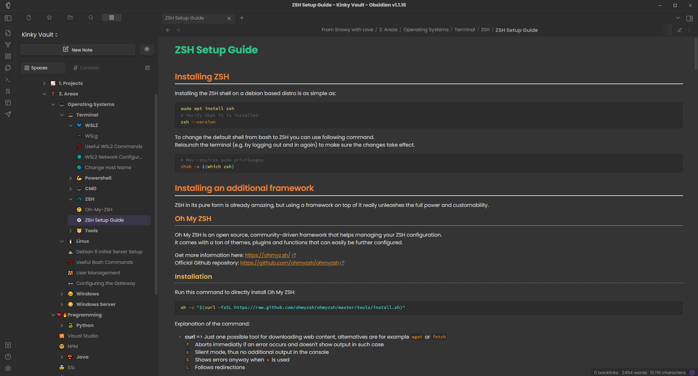

# kinky-vault

Hey 👋

This is the vault structure I personally use together with all the notes where I suppose they could be useful for you as well. 
The structure is loosely based on the PARA method.
You can learn more about it here: https://fortelabs.com/blog/para

Additionally, it contains the plugins I use and the [theme](https://github.com/dmytrodubinin/Obuntu-theme-for-Obsidian) which is slightly modificated by me.

## How To Use

1. If not already happened, please visit the official [Obsidian website](https://obsidian.md) and install it
2. Install the fonts I use for Obsidian:
    - Poppins: https://fonts.google.com/specimen/Poppins
    - Cascadia Code: https://github.com/microsoft/cascadia-code/releases
    - Cascadia Mono: https://github.com/microsoft/cascadia-code/releases
3. Have fun 😄💜

## Overview of Used Plugins

I use a few plugins to enhance the note taking experience.
Here is a short summary of them:

1. [Advanced New File](https://github.com/vanadium23/obsidian-advanced-new-file) 
    This plugin allows you to create new files with advanced templating and naming options, making it easier to maintain a consistent file structure in your vault.
    
2. [Advanced Code Block](https://github.com/lijyze/obsidian-advanced-codeblock) 
    This plugin enhances the default code block functionality in Obsidian, allowing for line numbers, custom themes, and improved copy/paste support.
    
3. [Make.md](https://www.make.md) 
    Make.md adds a powerful WYSIWYG Markdown editor to Obsidian, allowing you to edit your notes with a rich-text interface while preserving the underlying Markdown format.
    
4. [Folder Note](https://github.com/xpgo/obsidian-folder-note-plugin) 
    This plugin allows you to create and manage folder-specific notes that are automatically linked to a folder, making it easy to add context or summaries for each folder in your vault.
    
5. [CM Editor Syntax Highlight](https://github.com/deathau/cm-editor-syntax-highlight-obsidian) 
    This plugin adds syntax highlighting to the editor view in Obsidian, making it easier to read and edit your notes with inline code or code blocks.
